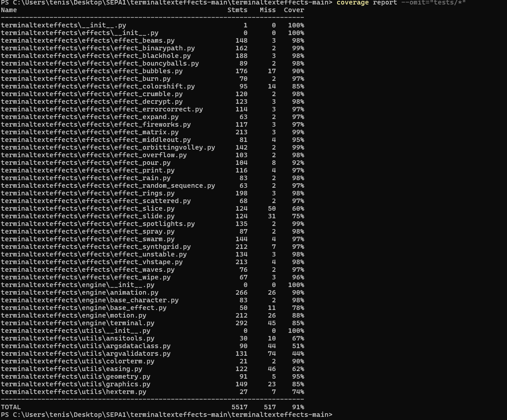
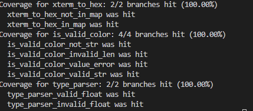
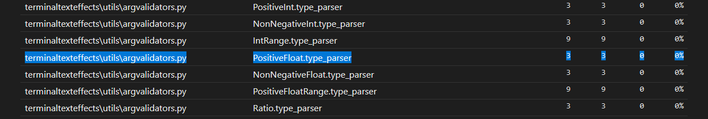
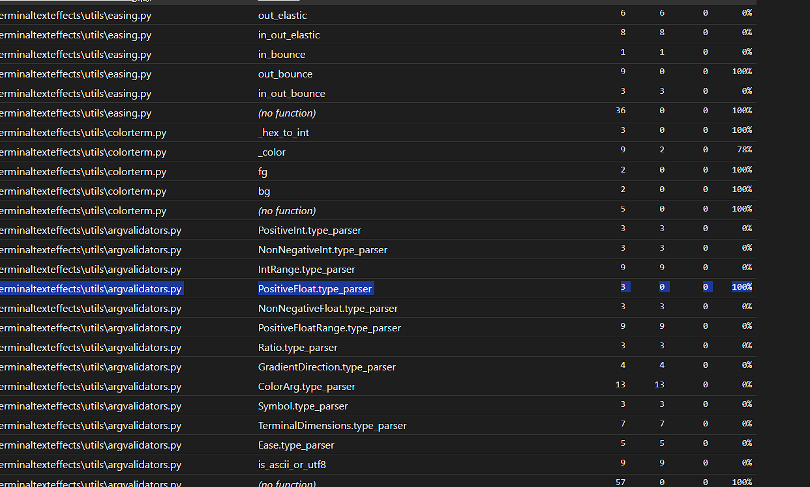
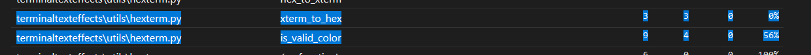
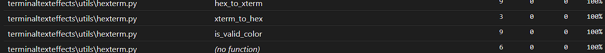

# Report for Assignment 1

## Project Chosen

**Name:** Terminal Text Effects

**URL:** [Terminal Text Effects](https://github.com/ChrisBuilds/terminaltexteffects.git)

**Number of lines of code and the tool used to count it:** 12,482 lines (found by Lizard)

**Programming Language:** Python

## Coverage Measurement

### Existing Tool

**Tool Used:** Coverage.py

1. After cloning the repository, open PowerShell.
2. Run the command:
    ```sh
    coverage run -m pytest tests/
    ```
3. Then run:
    ```sh
    coverage report
    ```
    to get the following report:



### Your Own Coverage Tool

#### Mihail-Dimosthenis Cretu

**Function 1:** `xterm_to_hex`  
**Link:** [Commit](https://github.com/cretud/terminaltexteffects/commit/9e3b9c2da09ec9539e140c4daefb37084e6c3d5d)  
**Screenshot:**  


**Function 2:** `is_valid_color`  
**Link:** [Commit](https://github.com/cretud/terminaltexteffects/commit/9e3b9c2da09ec9539e140c4daefb37084e6c3d5d)  
**Screenshot:**  


**Function 3:** `type_parser`  
**Link:** [Commit](https://github.com/cretud/terminaltexteffects/commit/9e3b9c2da09ec9539e140c4daefb37084e6c3d5d)  
**Screenshot:**  


<Repeat the following for each group member>

#### [Group Member Name]

**Function 1:** [Function 1 Name]  
**Link:** [Commit or Patch](#)  
**Screenshot:**  


**Function 2:** [Function 2 Name]  
**Link:** [Commit or Patch](#)  
**Screenshot:**  


## Coverage Improvement

### Individual Tests

#### Mihail-Dimosthenis Cretu

**Test 1:** `test_type_parser_valid` + **Test 2:** `test_type_parser_invalid`  
**Link:** [Commit](https://github.com/cretud/terminaltexteffects/commit/7d93d87f58fed95296635b5fe2f5cbb58c630c2f)  
**Screenshot Before:**  
  
**Screenshot After:**  
  

*Coverage improved from 0% to 100%.* First test checks the first branch of the method when input is valid and the second one checks the second branch when the input is invalid.

**Test 3:** `test_xterm_to_hex_valid` + **Test 4:** `test_xterm_to_hex_invalid`  
**Link:** [Commit](https://github.com/cretud/terminaltexteffects/commit/7d93d87f58fed95296635b5fe2f5cbb58c630c2f)  
**Screenshot Before:**  
  
**Screenshot After:**  
  

*Coverage improved from 0% to 100%.* First test checks the first branch of the method when input is valid and the second one checks the second branch when the input is invalid.

**Test 5:** `test_is_valid_color_invalid_length` + **Test 6:** `test_is_valid_color_invalid_characters` + **Test 7:** `test_is_valid_color_number`  
**Link:** [Commit](https://github.com/cretud/terminaltexteffects/commit/7d93d87f58fed95296635b5fe2f5cbb58c630c2f)  
**Screenshot Before:**  
  
**Screenshot After:**  
  

*Coverage improved from 56% to 100%.* First test checks the branch of the method when input is invalid by having the wrong string length, the second one checks the branch of the method when input is invalid by having invalid characters in the string, and the last one checks if the method returns true or false based on the value of the integer, outside the range 1-256 false, inside true.

<Repeat the following for each group member>

#### [Group Member Name]

**Test 1:** [Test 1 Name]  
**Link:** [Commit or Patch](#)  
**Screenshot Before:**  
  
**Screenshot After:**  
  

*Coverage improvement:* [Coverage improvement details]

**Test 2:** [Test 2 Name]  
**Link:** [Commit or Patch](#)  
**Screenshot Before:**  
  
**Screenshot After:**  
  

*Coverage improvement:* [Coverage improvement details]

### Overall

**Screenshot Before:**  
  

**Screenshot After:**  
  

## Statement of Individual Contributions

- **Mihail-Dimosthenis Cretu:** [Contributions]
- **[Group Member Name]:** [Contributions]
