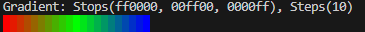
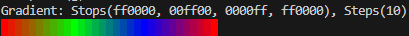

# 0.10.0 (ColorShift)

## Release 0.10.0

### ColorShift, Canvas, Better Compatibility, and more Customization

This release comes with a shiny new effect [ColorShift](../showroom.md#colorshift), increased customization for
[Waves](../showroom.md#waves) and [Wipe](../showroom.md#wipe) as well as renaming the
VerticalSlice effect to [Slice](../showroom.md#slice) with added slice directions.

Engine changes includes renaming the OutputArea class to [Canvas](../engine/terminal/canvas.md) and building out the
[Color](../engine/utils/color.md) class from what was previously a TypeAlias. In addition, to increase compatibility with
older version of Python (back to 3.8), a few minor changes were implemented including using annotations and removing the
occasional use of modern syntax where unnecessary. Additionally, input can be passed to TTE using the new `-i` argument.

Finally, a few new pages were added to the docs. Check out the [Cookbook](../cookbook.md) for interesting examples using
the TTE library and the [ChangeBlog](changeblog.md) (you're already here) for a more friendly breakdown of each release.

### ColorShift

The new [ColorShift](../showroom.md#colorshift) effect is largely in response to a [Feature Request
issue](https://github.com/ChrisBuilds/terminaltexteffects/issues/9) involving looping effects and the desire for a
simple RGB gradient effect. TTE supports [Gradients](../engine/utils/gradient.md) with an arbitrary number of stops and
steps. This means you can create gradients that transition through as many colors as you want, with as many steps
between colors. Fewer steps results in a more abrupt transition. As a part of the 0.10.0 update, I've added the `loop`
argument which causes the final color stop to blend back to the first. Here's an example:

#### Not Looped

```python
from terminaltexteffects.utils.graphics import Color, Gradient

g = Gradient(Color("#ff0000"), Color("#00ff00"), Color("#0000ff"), steps=10, loop=False)
print(g)
```



#### Looped

```python
from terminaltexteffects.utils.graphics import Color, Gradient

g = Gradient(Color("#ff0000"), Color("#00ff00"), Color("#0000ff"), steps=10, loop=True)
print(g)
```



Notice how the looped [Gradient](../engine/utils/gradient.md) transitions from blue, the final color stop, back to red, the first color stop. That
allows the smooth looped gradient animations seen in the [ColorShift](../showroom.md#colorshift) effect.

#### Traveling

[ColorShift](../showroom.md#colorshift) supports standing Gradients and traveling Gradients in the following directions:

* vertical
* horizontal
* diagonal
* radial

The travel direction can be reversed (think, center -> outside and outside -> center) using the
`--reverse-travel-direction` argument.

#### Never-Ending Effects

[ColorShift](../showroom.md#colorshift) marks the first effect in the TTE library to support infinite looping. This
feature is set by setting the
[ColorShiftConfig](../effects/colorshift.md#terminaltexteffects.effects.effect_colorshift.ColorShiftConfig) `cycles`
attribute to `0`. This will only work when using the effect in your code. The command line argument validator for
`cycles` will not allow values below `1`. This may change in the future, however at this time I'm not sold on having
effects that have to be killed when run as an application.

[ColorShiftConfig](../effects/colorshift.md#terminaltexteffects.effects.effect_colorshift.ColorShiftConfig)
`skip-final-gradient` will cause the effect to end when the last gradient cycle concludes. Otherwise, the
`final_gradient_`* configuration will be used to transition to a final state.

### OutputArea is now Canvas

On the slow but steady journey to documenting the engine from the perspective of writing effects, I realized
`OutputArea` is not a particularly good class name to describe the area of the terminal in which the effect is being
drawn. In addition, setting the terminal dimensions in the [TerminalConfig](../engine/terminal/terminalconfig.md) was not
intuitive when you imagine the terminal dimensions are referring to your actual terminal device. To remedy this,
`OutputArea` was renamed [Canvas](../engine/terminal/canvas.md) and the
`TerminalConfig.terminal_height`/`TerminalConfig.terminal_width` are now
`TerminalConfig.canvas_height`/`TerminalConfig.canvas_width`.

So what is the [Canvas](../engine/terminal/canvas.md)? It's the space in the terminal where the effect is actually being
rendered. When set automatically, it is determined by the bounding box that contains all of your text when it is passed to TTE. So if your
input text is 5 lines high and 30 characters wide, the [Canvas](../engine/terminal/canvas.md) is 5x30. This is independent of your terminal device
dimensions. Of course, if your text extends beyond the terminal device dimensions, it may be wrapped (if
`TerminalConfig.wrap_text` is `True`) which will result in different [Canvas](../engine/terminal/canvas.md) dimensions.

### 0.10.0 Demos

Speaking of [ColorShift](../showroom.md#colorshift), check it out.


Here's one of the new directions for [Waves](../showroom.md#waves), `center_to_outside`.


Here's [Wipe](../showroom.md#wipe) showing one of the new wipe directions, `outside_to_center`.


---

### Plain Old Changelog

[0.10.0](https://github.com/ChrisBuilds/terminaltexteffects/blob/main/CHANGELOG.md)
