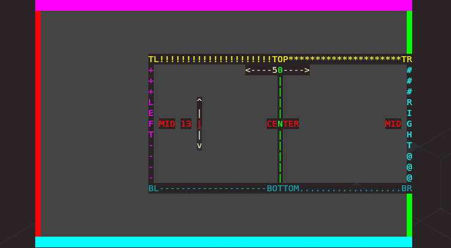

# 0.11.0 (Enter the Matrix)

## Release 0.11.0

### Release Summary (Matrix Effect, Anchoring, and Canvas Sizing)

This release features the oft requested [Matrix](../showroom.md#matrix) effect and improvements to
[Slice](../showroom.md#slice) and [Print](../showroom.md#print) as well as updates to many effects to support the new
[Canvas Overhaul](#canvas-overhaul).

The Engine underwent major changes to the [Canvas](../engine/terminal/canvas.md) class to enable arbitrary resizing as
requested [in an issue](https://github.com/ChrisBuilds/terminaltexteffects/issues/14) and support for anchoring the Canvas within the
terminal, and anchoring the text within the Canvas.

Minor changes include the addition of a `--version` switch, better handling of `ctrl-c` interrupts during effect
animations and a new [BaseCharacter](../engine/basecharacter.md) attribute `is_fill_character`.

### Housekeeping (We'll do it live.)

In a surprise turn of events, TTE was shared on [HackerNews](https://news.ycombinator.com/item?id=40503202) a few weeks
ago. I hadn't intended to share the project widely as, up to that point, it had only been used and tested by a small
number of people and I assumed the result would be a deluge of Issues that would be better handled slow and steady. I
only noticed it had been shared after seeing the repo star count jump from ~200 to ~500 in the span of an hour. A quick
google query for "TerminalTextEffects" presented the source of this attention.

Not only was TTE on the front page of HN,
it was in the number one spot, where it stayed for the entire day. Even more surprising, the comments were overwhelmingly
positive. And yet more surprising still, the number of issues reported was quite low and easily managed. By the time it
was all over, TTE made the top spot in the HN best-of and held it until it aged off three days later. Overall, an
excellent, if unplanned, "launch".

Since then, TTE has been featured in various blogs, Python news articles, the [VSCode YouTube
Channel](https://www.youtube.com/shorts/E3VP5g3oXX0), and many other place around the web. I'm glad to have more people
checking out this ridiculous project.

Now, on to the release info.

## Matrix Effect

---
When people first encounter TTE their first thought is something like, "Neat.", and their second thought is probably,
"Why?". Shortly after that, the obvious next thought is, "There must be a Matrix effect.". This led to disappointment
and bewilderment. Who would make a terminal visual effects library and not include the most famous terminal visual
effect in cinema history? Nobody. That would be crazy.


*I don't even see the code...*
*All I see is set_appearance(), set_coordinate(), set_visibility()...*

When I set out to replicate the Matrix digital rain effect, I thought, "surely this will only take a few hours". I mean,
it's basically characters dropping from the top of the terminal and occasionally changing colors between shades of
green, and swapping symbols. Easy.

I was incorrect.

After reviewing clips from the first film, and frame stepping through to learn all the secrets, I have discovered that
The Matrix digital rain effect has a surprising amount of complexity.

Here is the result of my analysis.

???+ Abstract "What Is The Matrix?"

    `Characters are not falling, they're activating in sequence, at varying speeds`

    : Yep, the perception that the characters are falling down the screen is a false memory (with one exception). The
    reality is that the cells are being activated in sequence from top to bottom in a given column. The delay between the
    activations is consistent within a column for the duration of a streak, but changes for each new streak.

    `Symbols consist of numbers, punctuation, Katakana, and a few others`

    : You'll need a good font to represent all of these characters, and the effect config will need an option to
    override and use a custom collection of characters.

    `Symbols and Colors in a given cell change randomly and separately`

    : The changes to symbol and color for a given character cell are not linked and must be calculcated separately.

    `The number of visible characters in a column varies from just a few, to the entire column`

    : Sometimes a streak is only three or four characters, other times it's the entire column.

    `Streak lengths are consistent during a streak, but vary between streaks`

    : The number of visible characters remains the same during a streak, once the number has been reached. As new character
    cells are activated, old cells are deactivated.

    `Only a single streak is active in a column`

    : A new steak will not start until the previous streak has completely fallen out of view.

    `Full column streaks are held in place for a random amount of time`

    : On the occasion that a streak is long enough to cover the entire column, it is held (no characters are removed) for a
    random duration.

    `Characters are a brighter color when added and the last few characters fade off`

    : The 'front' character in a streak is a near-white color and loses that color when it is no longer the front. The end
    of the streak fades toward black, but not evenly so.

    `Once a streak reaches the bottom of the terminal, the entire column may begin dropping`

    : Here's the exception to the "characters aren't falling" thing. When the front of a column reaches the bottom of the
    terminal, the entire column will sometimes drop together. Every character will actually shift down a single row. This
    happens at random intervals and is separate from the tail fade off that happens for every streak.

After discovering all of the above, I realized building this effect was going to take a little longer than I had
imagined. I wanted the TTE implementation of the Matrix effect to be as accurate as possible within the limits of the
medium. The actual movie effect has sub-character color variation and glow, which isn't a thing in a real terminal. But
pretty much everything else was doable.

### Matrix Effect Implementation, In Stages

To demonstrate the iterative process of building an effect, I recorded the effect output at each stage of completion.
Check out each section below to see the effect come together.

??? example "0 - Falling"
    Characters are activated in sequence with a random delay between activations, consistent within the streak life.

    

??? example "1 - Kata Symbols"
    Symbols are changed to katakana, punctuation, etc. and empty spaces in the canvas are filled with characters.

    

??? example "2 - Color/Symbol Shifting"
    Colors and Symbols are changed separately and randomly. In addition, the leading character is a brighter color.

    

??? example "3 - Column Lengths"
    Streak columns have varying lengths.

    

??? example "4 - Columns Fall Off and Recycle"
    Once reaching the bottom of the terminal, columns continue to drop characters off the back until completely gone.
    After which, it begins again with a new configuration.

    

??? example "5 - Head/Tail Colors"
    The characters at the head of the streak are bright and the characters near the tail fade off.

    

??? example "6 - Columns Drop"
    Once reaching the bottom of the terminal, sometimes the column will drop all characters by a row at random
    intervals. In this example, the columns shift to red when dropping for demonstration purposes.

    

??? example "7 - Filling"
    The effect conclusion in the Matrix film title sequence doesn't practically work on multi-line text as it would
    require a unique column for every character in every row. This would take a long time to complete. So the TTE
    implementation concludes by filling the screen with rain, then dissolving into the input text.

    

??? example "8 - Dissolving"
    The final dissolve into the input text.

    

## Canvas Overhaul

*18x24, pre-stretched, double primed...*

---

The [Canvas](../engine/terminal/canvas.md) has received a lot of love in this release. An issue was
[raised](https://github.com/ChrisBuilds/terminaltexteffects/issues/14) which asked for an obvious capability. Allow the
Canvas to exceed the size of the input text. This made sense, so here you go.

### Canvas Dimensions? Terminal Dimensions? Input Dimensions?

#### TTE Output 101

To make the most of the possibilities for *where* you output an effect, you need to understand the difference between the
Canvas, the Terminal, and the Input Text dimensions.


The image above helps to explain each component. To achieve this, the following settings were used:

- Canvas height set to match terminal height.
- Canvas width set to an exact value which is smaller than the terminal width.
- Canvas anchored to the center of the terminal.
- Text anchored to the center of the canvas.

Let's break this down.

##### Terminal

The [Terminal](../engine/terminal/terminal.md) class performs many functions, but as it pertains to this discussion, we are only interested in the
terminal dimensions.

`Terminal Dimensions`

: The terminal dimensions are based on your terminal emulator. TTE discovers the dimensions of your terminal emulator by
calling  `shutil.get_terminal_size()`. Should there be an issue that prevents terminal dimension discovery, a fallback
of `(80, 24)` is used.
  
: In the image above, you can see the terminal as the black area on the left and right edges. This indicates the Canvas
width is less than the terminal width, and the Canvas was anchored to the center.

##### Canvas

The [Canvas](../engine/terminal/canvas.md) is the space within the terminal where the effect takes place. From the
perspective of an effect, the Canvas is the entire world. Effects *should* be designed to reference the Canvas for all
requests for Coordinates to ensure Coordinates are anchored appropriates and within the correct space within the terminal.

`Canvas Dimensions`

: The Canvas dimensions are determined in one of three ways.
: - Specified exactly via the `--canvas-width` and `--canvas-height` arguments (or related TerminalConfig attributes).
: - Set to match the discovered Terminal dimensions by setting `--canvas-height` or `--canvas-width` to `0`.
: - Set to match the dimensions of the input text by settings `--canvas-height` or `--canvas-width` to `-1`.
: Note that the separate dimensions, width and height, can be specified through any of these methods independently.

: In the image above, you can see the canvas as the grey area surrounding the inner-text, with solid borders. In the
image, the Canvas is set to match the Terminal height (so there is no exposed terminal above or below) but the width is
less than the Terminal width. By anchoring the Canvas to the center, there is visible unused terminal space on either
side.

##### Input Text

The input text is the data passed to TTE on which the effect operates. TTE attempts to preserve this text in it's
original form unless the `--wrap-text` option has been passed. If the Canvas is set to match the input text dimensions,
the Canvas will be sized to the minimum bounding box that would contain all of the input text.

??? "How Input Text is Processed"

    - Whitespace characters to the right of the last non-whitespace character in a given line are stripped.
    - Empty lines are preserved. Whitespace to the left of a non-whitespace character is preserved.
    - Tabs are converted to four spaces.
    - Tab conversion can be specified using the `--tab-width` option.

`Input Text Dimensions`

: The input text dimensions are determined by the input text provided to TTE and will be modified based on the following:
: - If the `--wrap-text` option is passed, the text will be wrapped based on the Canvas dimensions, which will alter the
original text dimensions.

: - If the Canvas is set match the dimensions of the text and the `--wrap-text` option is passed, the text will be
wrapped based on the Terminal dimensions.

: - If the `--ignore-terminal-dimensions` option is passed, wrapping will be occur based on the Canvas size or not at
all (if the Canvas is set to match the text), however the output will exceed the dimensions of the terminal and will be
wrapped by the terminal emulator (resulting in expected effect behavior) unless the output is directed somewhere else.

Now that you understand how TTE handles the space where the effect is drawn, you can appreciate the latest updates to
the Canvas.

#### Arbitrary Canvas Sizing

As mentioned above, the Canvas size can be specified with the `--canvas-width` and `--canvas-height` options, as well as
the corresponding [TerminalConfig](../engine/terminal/terminalconfig.md) attributes. The following options are
supported:

- `-1` = Match the specified Canvas dimension to the corresponding input text dimension.
- `0` = Match the specified Canvas dimension to the corresponding terminal dimension.
- `n > 0` = Use the exact specified dimension.

Either dimension can be specified with any of the three options.

By sizing the Canvas greater than the input text, you can expand the total effect area and give the effects more room
the breath. Some examples are shown here. Note that these examples take advantage of [Anchoring](#anchoring) which will
be covered later in this blog post.

### Anchoring

*...my adventure in off-by-one errors...*

---

#### Anchoring the Canvas and/or Input Text

The Canvas and/or Input Text can be anchored around the respective container using the `--anchor-[canavs/text]` option. Acceptable values are any of the
Cardinal/Diagonal directions.

- `sw` = South West (bottom left corner) (**default**)
- `w` = West (centered on left edge)
- `nw` = North West (top left corner)
- `n` = North (centered on top edge)
- `ne` = North East (top right corner)
- `e` = East (centered on right edge)
- `se` = South East (bottom right corner)
- `s` = South (centered on bottom edge)

Here is an example of the Canvas anchored to the North East of the terminal, and the text anchored to the center of the
Canvas.


Here is an example of the Canvas centered in the terminal and the text anchored to the East.



Here is an example of the Canvas sized to the text and centered in the terminal. Notice how there is no gray space
outside the text. In this case, anchoring the text has no effect as there is no additional space in the Canvas.


### Effects are Canvas Aware

Effects often base many of their attributes on the Canvas. For example, the [Beams](../effects/beams.md) effect features
beams which travel across the entire Canvas. In the example below, the Canvas has been made wider and taller than the
input text, and the text has been anchored to the center.

Here's the invocation line and result:

`cat testinput/demo.txt | tte --canvas-width 100 --canvas-height 40 --anchor-text c beams`


Here's an example using the [Spray](../effects/spray.md) effect with a wide Canvas and the text anchored to the default
`sw` along with the height set to match the input text height. The spray origin is much further away than usual and the
resulting effect looks better.

`cat testinput/demo.txt | tte --canvas-width 150 --canvas-height -1 --anchor-text sw spray`


All these changes with the Canvas has led to some additional complexity when ensuring all effects operate in reference
to the Canvas dimensions properly in addition to the complexity handling the interactions between achoring, text wrapping,
and ignoring the terminal dimensions when appropriate. I'm sure there are edge cases somebody will find and report.
Looking forward to fixing those.

## Other Changes

---

- The `--version` switch will show the TTE version. High-tech stuff.

- Inputting a keyboard interrupt (`ctrl-c`) during an animation will gracefully interrupt the effect, restore the
  terminal state, and exit.

- A bug was fixed in the [Swarm](../effects/swarm.md) effect which was causing the first character group to be discarded. This
was noticed by a user who submitted a [great issue](https://github.com/ChrisBuilds/terminaltexteffects/issues/13)
documenting the unfortunate amputation of the *cowsay* cow.

``` bash
$ echo "The cow misses legs!" | cowsay | tte --no-color swarm
 ______________________     
< The cow misses legs! >    
 ----------------------     
        \   ^__^            
         \  (oo)\_______    
            (__)\       )\/\
                ||----w |   
                ||          
```

I'm happy to report that the bug was found and fixed, returning the cow to its intended state.

---

That's all for this release. Thanks for stopping by.

[0.11.0](https://github.com/ChrisBuilds/terminaltexteffects/blob/main/CHANGELOG.md)
