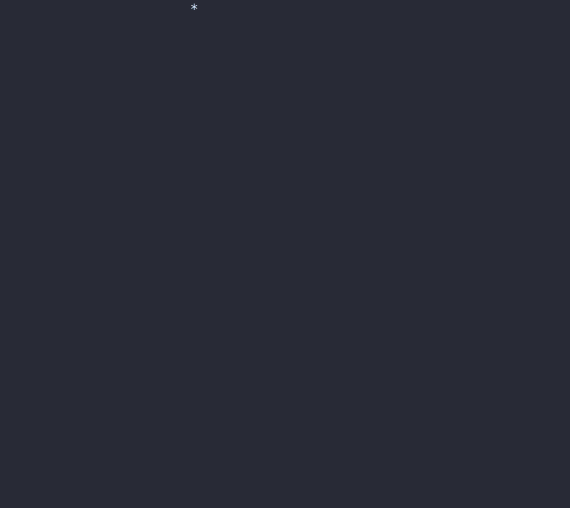

# 0.13.0 (Still Alive)

## Release 0.13.0

### Release Summary (Thunderstorm, Smoke, Spanning Trees, and Screensaver Support)

This release features two brand new effects, [Smoke](../showroom.md#smoke) and [Thunderstorm](../showroom.md#thunderstorm), as well as refreshed effects [Burn](../showroom.md#burn) and [Laseretch](../showroom.md#laseretch). Behind the scenes, the engine and application received some big changes, especially around argument parsing and configuration.

### This Took Too Long

---

Despite my intention, life stuff caused this update to take far longer than necessary. To address the unpredictability of the universe, I am going to make updates much smaller and more frequent. 

### Yer a ScreenSaver, Harry

---

In other news, TerminalTextEffects is currently a screensaver in [Omarchy](https://omarchy.org/).


I found out when they opened an issue/PR to support this TTE use-case. To that end, there are three new command-line options:

* `--reuse-canvas` : Rather than create lines beneath the current prompt as the canvas. This option causes the terminal handler to move the cursor up by the number of visible-lines in the input text. This will eliminate scrolling between effects. Note that this option has unpredictable results when used from a terminal prompt as the prompt itself and any intermediate output will offset the canvas from the prior run.

* `--no-eol` : When an effect ends, TTE normally prints a newline to place the prompt on a new line below the canvas. When this option is used, the newline is suppressed.

* `--no-restore-cursor` : TTE uses an ANSI sequence to hide the cursor during an effect and restores the cursor after the effect ends. When this option is used, the cursor will remain hidden.

Using these three options together, you can run TTE repeatedly in the same location in a terminal as one may do in a screensaver scenario.

These options can be used when using TTE as a library, too. So you can run effects repeated in your application.

??? info "Reusing the terminal in your Python application."
    Here we allow the first effect to run without the `reuse_canvas` option, to get the original canvas setup. Then we set `effect.terminal_config.reuse_canvas` to true for the remaining effects. All effects will run at the same position in the terminal, unless something else produces output.

    ```python
    from terminaltexteffects.effects import Highlight, Slide, Wipe

    text = ("EXAMPLE" * 10 + "\n") * 10

    for pos, effect_class in enumerate((Wipe, Highlight, Slide)):
        effect = effect_class(text)
        effect.terminal_config.reuse_canvas = bool(pos)
        effect.terminal_config.no_eol = True
        with effect.terminal_output() as terminal:
            for frame in effect:
                terminal.print(frame)
    ```

On that note, it's very cool to find TTE in the wild. If you are currently using TTE or have an idea for a use-case, feel free to open an Issue/Discussion for questions/support.

### New Effects (Thunderstorm and Smoke)

---

There are two new effects in this update, which feels a bit underwhelming given how long it took to release. Really, writing effects often takes a few hours +/- some time to polish. Moving into a more frequent and smaller release cycle will significantly aid in new effect production.

#### Thunderstorm

The text darkens as though storm clouds are rolling in. It begins to rain. Lightning strikes randomly around the canvas. When lightning reaches the bottom of the canvas, it flashes and all characters flash in sync with the strike. Sparks fly up from the lightning point of contact. Any characters in the path of the strike have a burning glow that lingers for a bit after the strike dissipates. Eventually, the rain stops and the characters lighten.


The storm time is configurable, as is the lightning strike chance. As usual, colors and gradients are also configurable.

#### Smoke

Text appears uncolored. Smoke begins to flow out of a random point and spread around the canvas. When a character encounters the smoke, the smoke and character flow through the final gradient colors until landing on the correct color. Smoke will expand through the entire canvas and colorize all characters.


The smoke will limit itself to the text boundary unless the `--use-whole-canvas` effect option is passed. Smoke symbols, gradient, and all other colors are configurable.

### Refreshed Effects

---

#### Burn

Burn has been upgraded with a more realistic burn pattern and new smoke particles. A random spot on the canvas is chosen for the initial ignition, the flame spreads out in all direction from this point. Smoke is emitted from some of the burned characters.


#### LaserEtch

Laseretch has a new, and default, etch pattern, in addition to the existing patterns. The laser travels around the input text rather than only moving in rows/columns/diagonals. 




### Minimum Spanning Trees and Search/Explore

---

As a bit of background, I have an older project called [TerminalMaze](https://github.com/ChrisBuilds/terminalmaze) which is the primordial soup from which many of the TTE concepts emerged. TerminalMaze has a very different animation mechanism and features a DSL for describing animations via TOML config. None of this is properly documented at this time. I hope to create a nice README for it in the near future.

TerminalMaze uses various Minimum Spanning-Tree algorithms to build mazes in the terminal. The nodes in the graph are animated based on the current activity of the algorithm. For example, below you will see a visualization of the recursive backtracker algorithm. When the algorithm links a node into the graph, the node glows bright greenish-white with a gradient toward green. When the algorithm pops the node off it's stack, the color is returned to white. 

There are examples of many algorithms below, with unique animations corresponding to the algorithm's decision logic.

=== "Recursive Backtracker"
    

=== "Prims Simple"

    

=== "Prims Weighted"

    

=== "Aldous Broder"

    

=== "Wilsons"

    

=== "Recursive Division"

    

=== "Kruskals Randomized"

    

=== "Ellers"

    


A more interesting demonstration of the TerminalMaze animation can be seen by building a maze and then running a Breadth First search across it to find the bottom-right-most cell. The Breadth First algorithm has a more elaborate animation.


#### Graph Algorithms in TTE

I've wanted to incorporate many of the algorithms from TerminalMaze into TTE. I finally got around to designing the algorithm interface and relevant methods/attributes on the Terminal/Canvas/EffectCharacter classes and can now easily provide graphing algorithms to the effects.

The Canvas can be treated like a graph with all EffectCharacters as nodes. Nodes can be linked and their neighbors queried. That's pretty much all it takes.

This new feature has already been put to use in the new and refreshed effects.

* Smoke : Smoke is a Prims Weighted tree being explored by a breadth first search. All new EffectCharacters explored are turned into smoke followed by the character animation.

* LaserEtch : The new laser path is a Recursive Backtracker tree with the backtracking removed.

* Burn : The new burn pattern is a Prims Simple tree where the node-link order is used as the ignition order for the characters.

I have many ideas for new effects which are enabled by these sorts of algorithms.

### Misc

---

#### Random Effect

TTE now has a random effect option that is used like this:

`ll | tte random_effect`

You can still pass global terminal options, but you cannot pass effect-specific options.

!!! success "Valid Invocation with Terminal Config"

    `ll | tte --canvas-height 0 --canvas-width 0 --anchor-text c random_effect`

    Passing terminal options such as `--canvas-height` works.

!!! failure "Invalid Invocation with Effect Config"

    `ll | tte random_effect --final-gradient-stops 00ff00 ff0000 0000ff`

    Passing effect options such as `--final-gradient-stops` does not work.

#### Faster TTE Startup

TTE will now launch faster as a result of the changes in Config/Terminal/Argument parsing classes. How much faster? Not sure but definitely something.

#### Framerate Reduced

TTE has always set the target framerate to 100FPS. This framerate was chosen arbitrarily during initial development and I mostly forgot about it. This framerate is unnecessarily high and leaves little time for the effects to do more complicated work between frames. It has been adjusted to 60FPS and all effects have had animation frames and movement speeds adjusted for visual parity with 100FPS. This should result in smoother animation on slower machines for effects which do a lot of dynamic work during the run. 

### Moving Forward

---

Look forward to more frequent updates. Likely many of which are only a single effect or two without bundling them with months of engine changes nobody cares about. Who knows, maybe one day I'll get to actually writing a guide to producing your own effects. I won't consider TTE _Done_ until that happens.

---

### Plain Old Changelog

[0.13.0](https://github.com/ChrisBuilds/terminaltexteffects/blob/main/CHANGELOG.md)
