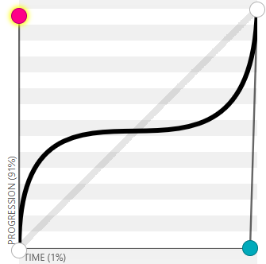

# 0.14.0 (Easier Easing)

## Release 0.14.0

### Release Summary (Easing and Random Filters)

This release features two new [Easing](https://easings.net/) classes and improves the functionality of the random effect selection CLI option. It also removes an effect which was inadvertently included in the last release. There are some effect changes/upgrades as well, but no new effects.

### Sequence Easing

Easing is a powerful tool when animating. It's how you bring life to otherwise boring linear motion/progression. TTE uses easing for motion and animation. However, it's also useful to ease progress over a sequence. For example, the [Wipe](../effects/wipe.md) effect uses easing to enable the `--wipe-ease` argument.

In the effect, a subset of a sequence of characters is 'activated' based on the output of an easing function. For example, when the easing function outputs 0.1, the first 10% of the character list is activated. That's pretty simple, until you realize some easing functions increase and decrease the output number as they progress. See [easeOutBounce](https://easings.net/#easeOutBounce) for example.

Handling this means tracking not just the added characters, as the function output increases, but also the removed characters when the function output decreases. These adjustments must be made after each step in the function. If you do it right, you can achieve the following:


I had found myself repeating the logic surrounding this in multiple effects such as [Sweep](../effects/sweep.md) and [Highlight](../effects/highlight.md). Implementing this was always enough of a challenge that I was not exploring the various ways eased sequences could improve other effects. To reduce friction in the future, I created a class `SequenceEaser` which exposes the relevant data while an easing function is applied to n sequence. These attributes include which elements of the sequence were added/removed on the last step. Using the `SequenceEaser` class reduced dozens of lines of logic to:

=== "Wipe Easing"

    ```python
    self.easer.step()
    for group in self.easer.added: # (1)
        for character in group: # (2)
            character.animation.activate_scene("wipe")
            self.terminal.set_character_visibility(character, is_visible=True)
            self.active_characters.add(character)
    for group in self.easer.removed: # (3)
        for character in group:
            character.animation.deactivate_scene()
            character.animation.query_scene("wipe").reset_scene()
            self.terminal.set_character_visibility(character, is_visible=False)
    ```
    
    1. `easer.added` is all sequence elements that fall within the positive difference between the easing functions last two steps.
    2. Wipe groups characters into lists representing a row/column/diag based on the `--wipe-direction` option.
    3. `easer.removed` is all sequence elements that fall within the negative difference between the easing functions last two steps.

`SequenceEaser` will lead to more experimentation and, hopefully, more interesting effects.

Here's an example that shows how helper classes such as `SequenceEaser` and the new spanning tree algorithms can be used to achieve otherwise complicated results with very few lines of code.


=== "Custom Ease over a Tree"

    ```python
    self.tree = PrimsSimple(
        self.terminal,
        limit_to_text_boundary=True,
        starting_char=self.terminal.get_character_by_input_coord(self.terminal.canvas.text_center),
    )
    self.sequence_easer = tte.easing.SequenceEaser(
        sequence=self.tree.char_link_order,
        easing_function=tte.easing.make_easing(0, 0.97, 0.99, 0.05),
        total_steps=100,
    )

    # ... skip to iterator logic ...

    if self.active_characters or not self.sequence_easer.is_complete():
            self.sequence_easer.step()
            for char in self.sequence_easer.added:
                self.terminal.set_character_visibility(char, is_visible=True)

    ```

This combines a `PrimsSimple` tree with a `SequenceEaser` applying a custom easing function via `tte.easing.make_easing` to the sequence of characters representing the link-order of the Prims tree.

The custom easing function is based on a bezier curve which looks like this:



So we should see fast progression over the tree at the start, followed by a slowing down to a near stop, then fast progression until the end. The Prims tree was set to start from the center of the canvas. Here's the result:


### Do Random Better

Previously, the `random_effect` option was sort-of hacked in by imitating an effect subparser and swapping an effect name into the `sys.argv` list. This had limited functionality without getting even more hack-y. This was refactored and, as such, random now supports the following:

```
  --random-effect, -R   Randomly select an effect to apply
  --include-effects INCLUDE_EFFECTS [INCLUDE_EFFECTS ...]
                        Space-separated list of Effects to include when randomly selecting an effect
  --exclude-effects EXCLUDE_EFFECTS [EXCLUDE_EFFECTS ...]
                        Space-separated list of Effects to exclude when randomly selecting an effect
```

### Plain Old Changelog

[0.14.0](https://github.com/ChrisBuilds/terminaltexteffects/blob/main/CHANGELOG.md)