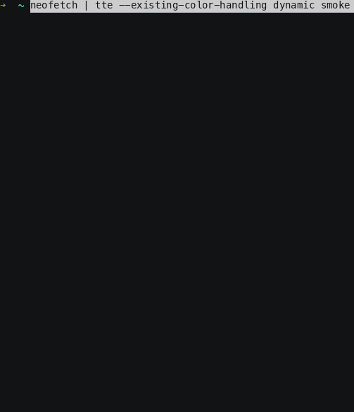
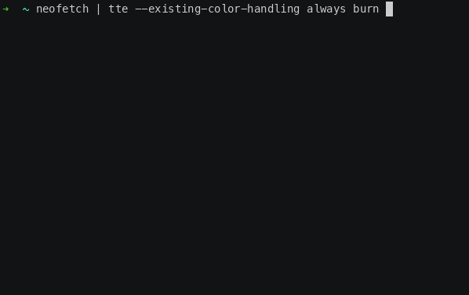

# 0.15.0 (Quality of Life Catch-Up)

## Release 0.15.0

### Release Summary (Shell Completion, Dynamic Colors, and Better Terminal Input)

This release is mostly about catching up on the quality-of-life work that makes TTE nicer to use in real shells with real terminal output.

There are no new built-in effects this time. Instead, TTE can now generate shell completions for `bash` and `zsh`, handle more of the ANSI escape sequence soup produced by terminal tools such as `neofetch` and `fastfetch`, and do a much better job preserving input colors in `existing_color_handling="dynamic"` mode.

There is also support for discovering user-provided effects from a config directory, along with a pile of engine documentation and test improvements. This is the sort of release where the most important work is not always glamorous, but it makes everything else feel a bit less wobbly.

### Push Tab, Receive Effect

---

TTE can now generate shell completions:

```bash
tte --print-completion bash
tte --print-completion zsh
```

For one-off use:

```bash
eval "$(tte --print-completion bash)"
```

or:

```zsh
eval "$(tte --print-completion zsh)"
```

If you want completions to stick around, add the relevant command to your shell startup file. The generated completion script includes discovered effects and their options, so custom effects show up there too.

One small but useful bit of polish: the `zsh` completion script now initializes `compinit` and `bashcompinit` when needed. That means the basic `eval "$(tte --print-completion zsh)"` path works with less shell ceremony.

There is something deeply pleasing about writing an overcomplicated animation engine and then finally giving your shell the ability to complete `--final-gradient-direction`.


### Go Fetch

---

TTE has supported parsing ANSI colors from input for a while, but terminal applications do more than color text. Fetch-style tools often move the cursor around to lay out a logo and system information side-by-side. Previously, some of those cursor movement sequences could leak through as visible text. That is a bad look, in the very literal sense.

TTE now interprets common cursor movement CSI sequences into its virtual input canvas:

```text
A B C D E F G H f
```

It also accepts common DEC private mode toggles for cursor visibility and line wrapping as no-op input state:

```text
?25h ?25l ?7h ?7l
```

That does not mean TTE is a full terminal emulator. It is not. But it now understands enough of the layout language used by common fetch applications to preserve the intended shape instead of eating the control characters and leaving crumbs on the floor.

The color parser also got more complete. TTE now supports 3-bit and 4-bit SGR foreground/background colors, reset sequences, and mixed style/color SGR sequences. Bold standard ANSI foreground colors are preserved as bright colors, which better matches how normal terminals display many fetch outputs.

=== "Unparsed Fetch Sequences"

    

=== "Parsed Fetch Sequences"

    

### Dynamic Colors Everywhere

---

In `0.12.0`, TTE added `--existing-color-handling` with three modes:

`ignore`

: Strip parsed input colors and let the effect do its normal thing.

`always`

: Keep input colors on the characters all the time, even when that removes some of the effect's personality.

`dynamic`

: Let the effect decide how to use the input colors.

That last option is the interesting one, but it also requires effect-by-effect care. Some effects should keep their own colors during the action and resolve to input colors at the end. Some should use input colors the whole way. Some need a neutral fallback for uncolored input. Some need to treat background-only spaces as real input. It goes on.

This release fills in a lot of that work.

Examples:

* [Burn](../effects/burn.md), [LaserEtch](../effects/laseretch.md), and [Matrix](../effects/matrix.md) now process input spaces that carry parsed ANSI colors, which preserves background-color art cells.
* [Beams](../effects/beams.md), [BinaryPath](../effects/binarypath.md), and [Overflow](../effects/overflow.md) no longer accidentally finish uncolored input in effect-owned colors when using `dynamic`.
* [Highlight](../effects/highlight.md) now bases the highlight on parsed foreground colors and preserves parsed backgrounds, including background-only spaces.
* [Rings](../effects/rings.md), [Scattered](../effects/scattered.md), [Slice](../effects/slice.md), [Slide](../effects/slide.md), [Spray](../effects/spray.md), and [Wipe](../effects/wipe.md) can now run with input colors driving the whole effect.
* [Thunderstorm](../effects/thunderstorm.md), [Unstable](../effects/unstable.md), and [VHSTape](../effects/vhstape.md) now start from input colors, do their effect-specific chaos, and return to the input colors or terminal default state correctly.

This is one of those changes where the feature sounds simple from the outside:

> keep my colors

And then inside the engine it becomes:

> preserve foreground and background independently, don't invent a foreground for background-only cells, don't erase colored spaces, keep helper/fill characters effect-owned, let uncolored input return to terminal default, and make all of that happen at the visually correct part of each effect

=== "Dynamic Colors"

    

=== "Always Colors"

    

=== "Ignore Colors"

    

### Your Effects Live Here Now

---

TTE can now discover effects from:

```text
${XDG_CONFIG_HOME}/terminaltexteffects/effects
```

If `XDG_CONFIG_HOME` is not set, that resolves to:

```text
~/.config/terminaltexteffects/effects
```

Effect files are normal Python files. For example:

```text
~/.config/terminaltexteffects/effects/effect_custom.py
```

If the file provides a `get_effect_resources()` function, TTE can register it just like a built-in effect. The function returns the CLI command name, the effect class, and the config class:

```python
def get_effect_resources():
    return "custom", CustomEffect, CustomConfig
```

After that, the custom effect can be invoked from the CLI:

```bash
cat message.txt | tte custom
```

The important part is that user effects now participate in the same parser-building path as built-in effects. Runtime parsing, effect help text, random-effect selection, and generated completions all build from the same discovered effect definitions.

### Small API Tweaks

---

There are also a number of engine and documentation improvements in this release.

The final-gradient CLI arguments are now shared helpers:

```python
FinalGradientStopsArg
FinalGradientStepsArg
FinalGradientFramesArg
FinalGradientDirectionArg
```

All effects now use these helpers, which keeps parser defaults and help text more consistent. This also matters for shell completion because completions are only as good as the parser they are generated from.

Several spanning tree generators received bug fixes and focused test coverage. The highlights:

* `SpanningTreeGenerator.get_neighbors()` now honors `unlinked_only=False`.
* `PrimsSimple` applies `limit_to_text_boundary` more consistently.
* `PrimsWeighted` limits random starting-character selection to the text boundary when requested.
* `BreadthFirst` initializes correctly when `starting_char` is omitted and records discovered characters once.
* `AldousBroder` returns immediately once all characters are linked.

Path and scene deactivation are also more convenient. These calls now accept an object, an ID string, or no argument:

```python
character.motion.deactivate_path()
character.motion.deactivate_path("path_id")
character.animation.deactivate_scene()
character.animation.deactivate_scene("scene_id")
```

The no-argument form deactivates the currently active path or scene. Event registrations for `DEACTIVATE_PATH` and `DEACTIVATE_SCENE` support the same shapes.

### Plain Old Changelog

[0.15.0](https://github.com/ChrisBuilds/terminaltexteffects/blob/main/CHANGELOG.md)
