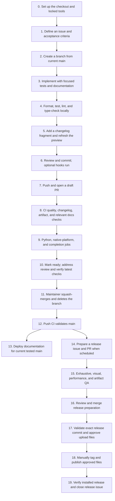

# TerminalTextEffects: a developer's guide from setup to release

Audience: developers joining TerminalTextEffects (TTE), including developers working with coding agents.

This guide explains the repository's contribution instructions, tooling, and workflows. The linked repository files are the authoritative instructions; consult them when commands, supported versions, or workflows change. Examples use a macOS/Linux shell and run from the repository root unless stated otherwise.

**Normal work follows an issue → branch → draft PR → QA and CI → review → squash merge pipeline.** Merging updates development `main` and eventually its documentation. A package release is a separate, explicitly approved pipeline.

## The complete pipeline at a glance



CI means **continuous integration**: automated checks on changes entering the project. Our automatic deployment delivers documentation through GitHub Pages. PyPI packages and GitHub releases are published manually, with separate approval. There is no private CI server and no automatic package-publication workflow.

## 0. Get oriented and set up the environment

**Trigger:** first work in a clone, or switching to a branch with a different lockfile.

**Purpose:** use the same dependency versions as other developers and CI, and understand what belongs in a release.

Read these first:

| Source | What it controls |
| --- | --- |
| [CONTRIBUTING.md](https://github.com/ChrisBuilds/terminaltexteffects/blob/main/CONTRIBUTING.md) | Issue, branch, PR, QA, and merge process |
| [AGENTS.md](https://github.com/ChrisBuilds/terminaltexteffects/blob/main/AGENTS.md) | Repository-specific implementation and verification rules |
| [pyproject.toml](https://github.com/ChrisBuilds/terminaltexteffects/blob/main/pyproject.toml) | Package metadata, dependency groups, Python minimum, tool configuration, build rules |
| [uv.lock](https://github.com/ChrisBuilds/terminaltexteffects/blob/main/uv.lock) | Resolved versions, hashes, and environment-specific dependency selections |
| [.github/CI.md](https://github.com/ChrisBuilds/terminaltexteffects/blob/main/.github/CI.md) | Required CI jobs and their scope |
| [RELEASING.md](https://github.com/ChrisBuilds/terminaltexteffects/blob/main/RELEASING.md) | Release preparation, publication approval, and verification |

Clone the project, inspect your checkout, and install the development group:

```sh
git clone https://github.com/ChrisBuilds/terminaltexteffects.git
cd terminaltexteffects
git status --short
uv sync --locked --group dev
```

`uv` creates or updates `.venv`. The development group includes test, quality, artifact, documentation, and hook tools. `--locked` checks that `pyproject.toml` and the lock agree; it does not silently resolve new versions. Run `uv lock` deliberately when an approved dependency or package-metadata change requires it, then review the diff.

Use `.venv` executables, rather than whatever tool version happens to be installed globally. The project minimum on development `main` is Python **3.9.2**. You can develop with a newer tested interpreter; Pyright checks compatibility against Python 3.9. The published 0.15.0 release still declares Python 3.8 minimum. Package metadata may retain the current released version during development; that does not mean unreleased changes are already on PyPI.

The commands below assume POSIX `.venv/bin` paths. Native Windows environments use `.venv/Scripts`; for example, `uv run --no-sync python -m pytest ...` or `uv run --no-sync python -m ruff ...` uses the existing environment. The native-platform CI jobs use this form. The optional hook configuration currently names `.venv/bin/python`; do not assume those hook entries are portable unchanged to native Windows.

**Complete when:** locked tools install successfully, you know your branch and worktree state, and you have read the relevant project instructions.

### Repository map

| Location | Responsibility |
| --- | --- |
| `terminaltexteffects/engine/` | Shared animation, movement, configuration, terminal, and effect infrastructure |
| `terminaltexteffects/effects/` | Finished, shipped effects |
| `terminaltexteffects/utils/` | Shared utilities, validators, and completion support |
| `terminaltexteffects/completions/` | Generated Bash, Zsh, and PowerShell scripts shipped with the package |
| `dev_effects/` | Explicitly opted-in unfinished effects, excluded from release distributions |
| `tests/` | Engine, effect, CLI, tooling, packaging, and workflow regression tests |
| `tools/` | Repository QA, changelog, completion, development, build, and performance helpers |
| `docs/`, `mkdocs.yml`, `overrides/` | Documentation sources, navigation/configuration, and theme overrides |
| `changelog.d/` | Per-issue release-note fragments and explicit skip reasons |
| `.github/` | Workflows, issue/PR templates, and CI/dependency documentation |

## 1. Define the issue before implementing

**Trigger:** a bug, requested feature, maintenance task, or documentation improvement.

**Purpose:** make the intended result reviewable before code changes. An issue records scope and acceptance criteria; it is not simply a title for a branch.

Include the observed problem, reproduction steps for bugs, expected behavior, proposed scope, and observable acceptance criteria. Record agreed option/default/visual changes before implementing them. Keep unrelated findings in separate issues.

For agent-managed issues, fill metadata at creation:

- Assignee: `ChrisBuilds`, recording accountable maintainer ownership.
- Exactly one type label: `bug`, `enhancement`, `documentation`, or `maintenance`.
- At least one area label: `effects`, `engine`, `cli`, `ci`, or `release`.
- The intended milestone only when scheduled for that release. Otherwise leave it unset and write `Release target: not scheduled` in the body.
- Leave Project unset. Do not invent labels duplicating draft status, CI results, or milestones.

The GitHub templates provide some defaults, but cannot infer every area or release target. Verify metadata after creation. `blocked` and `needs-decision` describe actual impediments, with an explanation.

**Complete when:** the problem is verified where applicable, the scope is understood, and acceptance criteria and metadata are recorded.

## 2. Create an isolated issue branch

**Trigger:** the issue is ready for implementation.

**Purpose:** keep incomplete work away from protected `main`, and make the PR's changes attributable to one issue.

```sh
git switch main
git pull --ff-only
git switch -c fix/123-short-description
```

Use the actual issue number. Branch names follow `<type>/<issue-number>-<short-description>`, such as `feat/123-new-effect` or `docs/123-support-guide`. Inspect and preserve existing local changes before switching. Do not commit or push development changes directly to `main`.

Dependabot branches are the documented exception: the bot creates a branch and PR first. Keep that generated branch and create a real tracking issue during triage; see the dependency section below.

For agents, an implementation assignment authorizes routine branch creation, implementation, commits, pushes, and draft PR creation. It does **not** authorize merging, tagging, or publishing.

**Complete when:** the branch starts from current `main`, has the correct name, and contains only the intended work.

## 3. Implement the change and its supporting material

**Trigger:** work on the issue branch.

**Purpose:** deliver the behavior described by the issue, with enough evidence for another contributor to review it.

Change implementation, relevant regression tests, documentation, and generated resources together. Preserve existing callers and configuration contracts. Tests should exercise meaningful behavior and edge cases; a new test is not required merely to mirror a trivial implementation detail.

For effects, visual identity is part of behavior. Get agreement before changing options, defaults, or appearance/pacing. Performance claims require before/after measurements with controlled input/seeds and frame/output invariants, or an explanation of intentional visual changes. Follow [the performance guide](performance.md).

### Keep experiments outside shipped effects

Create unfinished effects under root `dev_effects/`, never as scratch modules inside `terminaltexteffects/effects/`.

```sh
printf 'Hello' | ./.venv/bin/python -m tools.dev dev
```

Replace `dev` with the effect command name. The development launcher explicitly enables prototype discovery. `TTE_DEV_EFFECTS_DIR` enables it for parser-based tools; ordinary CLI discovery and bundled completions remain independent of prototypes. Flat modules use the normal `get_effect_resources()` interface and absolute package imports.

Reviewed issue-branch prototypes may be committed; ignored personal scratch work remains local. The build configuration excludes development effects from wheel and source distributions. Artifact verification deliberately injects a prototype into a temporary build copy to check those exclusions.

Promotion requires a reviewed PR moving the finished effect into the shipped package, permanent tests, documentation, regenerated completions, and a user-facing fragment. See [dev_effects/README.md](https://github.com/ChrisBuilds/terminaltexteffects/blob/main/dev_effects/README.md).

### Update completions when the CLI changes

```sh
./.venv/bin/python tools/generate_shell_completions.py
./.venv/bin/python tools/generate_shell_completions.py --check
```

The generator builds from the bundled-effects parser. Bash/Zsh generation uses shtab; PowerShell generation uses parser metadata and the project template. Commit refreshed resources rather than editing them by hand. Both CLI entry points are registered. The terminal application displays output; the shell supplies completion. PowerShell coverage targets version 7+, not Windows PowerShell 5.1 or Command Prompt.

**Complete when:** implementation and supporting files reflect the agreed scope, without unrelated changes or accidental shipped prototypes.

## 4. Run focused local QA

**Trigger:** after changing code, before committing a verified revision.

**Purpose:** catch mistakes quickly near the edit. The broad compatibility matrix runs on GitHub, rather than repeatedly occupying development sessions.

For changed Python files, use this order:

```sh
./.venv/bin/ruff format path/to/changed.py tests/test_changed.py
./.venv/bin/pytest -n auto tests/test_changed.py
./.venv/bin/ruff format --check path/to/changed.py tests/test_changed.py
./.venv/bin/ruff check path/to/changed.py tests/test_changed.py
./.venv/bin/pyright --pythonpath ./.venv/bin/python path/to/changed.py tests/test_changed.py
```

Start with the narrowest useful test node, filter, or file. Effect work normally targets `tests/effects_tests/test_<effect>.py`. Use `ruff check --fix` for safe lint fixes and review its edits. Unsafe fixes require deliberate inspection. Formatting controls presentation, lint checks code issues/conventions, and type checking checks how values and APIs fit together. None replaces pytest.

Highly parametrized effect-configuration tests use deterministic **pairwise** selection for designated tests: every parameter value and every pair of values is represented without collecting the full Cartesian product. `tests/conftest.py` and `tests/pairwise.py` implement this; collection regressions protect its fixture/ID behavior. Pairwise is a compromise for routine CI, not a claim to cover every combination.

Default pytest excludes `manual` and `visual`. For human inspection, select relevant tests without parallel workers and disable output capture:

```sh
./.venv/bin/pytest -s -m visual tests/test_effects.py -k 'Wipe'
./.venv/bin/pytest -s -m manual tests/test_effects.py -k 'Wipe'
```

Replace the effect selection. Reserve `--exhaustive-effect-args` for pre-release validation or an explicitly needed full-matrix investigation. A skipped visual test is not evidence of inspection.

For documentation-only work, use appropriate diff/format checks and a strict documentation build when relevant:

```sh
./.venv/bin/python -m mkdocs build --strict
```

For GitHub Actions workflow changes, install actionlint 1.7.12 and ShellCheck as described in
[workflow linting](https://github.com/ChrisBuilds/terminaltexteffects/blob/main/.github/CI.md#workflow-linting),
then run `./.venv/bin/python tools/check_workflows.py`. This checks workflow structure,
expressions, job dependencies, and Bash/sh scripts without editing files. The optional
`workflows` hook runs only when explicitly invoked with `--hook-stage manual`; ordinary
commit hooks do not require these external tools.

A successful local build verifies documentation; it does not deploy it. Strict builds fail on relevant warnings/errors and configured link validation. A dependency update deserves integration checks for the tools it affects: successful lock resolution alone does not prove compatibility or safe behavior.

**Complete when:** applicable focused tests, touched-file formatting/lint/types, and generated-file checks pass. Report remaining uncertainty instead of overstating QA.

## 5. Record the changelog decision

**Trigger:** every issue implemented through a PR.

**Purpose:** accumulate reviewable release notes as work happens, rather than reconstructing them at release time.

Add `changelog.d/<issue-number>.<category>.md`. Categories appear in this order: `breaking`, `added`, `changed`, `deprecated`, `removed`, `fixed`, `security`. Write a concise user-facing result; breaking changes need migration guidance.

Internal changes and fixes for bugs introduced in the same unreleased version use `<issue-number>.skip.md` explaining the exemption. Skip reasons are validated but not published. Use a real issue number, not the PR number as a substitute.

```sh
./.venv/bin/python tools/generate_changelog.py
./.venv/bin/python tools/generate_changelog.py --check
```

Commit the fragment and refreshed `CHANGELOG.md` preview together. Towncrier renders fragments using the project template; the helper validates filenames/content and replaces only the generated Unreleased block. Never edit that block directly. CI additionally checks the committed branch contains a changelog decision; changing the preview alone does not satisfy it.

`CHANGELOG.md` remains one canonical history file. Releases before 0.16.0 retain their existing format. New dated sections use Towncrier's categories. The ChangeBlog is optional narrative/demo material, not another required release-note history.

Release-preparation PRs consume existing fragments into a dated section instead of adding a new fragment; step 14 explains that exception.

## 6. Review the diff and commit

**Trigger:** a coherent revision is ready to record.

**Purpose:** preserve a useful unit of work and ensure staging contains only the issue's intended changes.

Inspect the worktree and staged diff, add explicit paths, and commit. Keep personal working notes and unrelated edits out of commits.

```sh
git diff --check
git add path/to/changed.py tests/test_changed.py changelog.d/123.fixed.md CHANGELOG.md
git diff --cached
git commit -m 'Fix the concrete behavior described by the issue'
```

### Optional pre-commit hooks

Install once per compatible clone after syncing locked tools:

```sh
./.venv/bin/pre-commit install --allow-missing-config
```

`.pre-commit-config.yaml` defines local hooks implemented through `tools/run_hook.py`. On `git commit`, staged Python files run safe Ruff lint fixes, formatting, and read-only Pyright. Changelog-related staged changes run fragment/preview validation. The changelog hook constructs a temporary snapshot from the Git index, including the renderer/configuration; untracked fragments and unstaged edits cannot make the check pass accidentally.

If a hook edits files, the commit stops: review, restage, and retry. Pre-commit sets aside unstaged tracked edits and restores them; overlapping changes can force rollback of hook edits to preserve your work. Resolve that situation deliberately. `--allow-missing-config` allows older branches without the hook configuration to skip it.

Manual targeted hook invocation is available with `pre-commit run --files ...`. Hooks are optional and bypassable; they do not replace focused tests or required CI. Avoid routine `--all-files` hook runs that apply fixes outside your scope. CI uses read-only whole-project checks instead.

**Important:** a local Git commit does not start GitHub Actions. Hooks run locally at commit time; remote CI starts on the events in step 7.

## 7. Push and open a draft PR

**Trigger:** a branch is ready for reviewable progress or needs broad CI feedback.

**Purpose:** expose the committed diff to GitHub's checks and collaborative review.

```sh
git push -u origin fix/123-short-description
```

Open a **draft** PR targeting `main`, assign `ChrisBuilds`, and mirror issue labels/milestone. Explain the resulting behavior, validation, and limitations; include `Closes #123`. Release PRs use `Refs #<release-issue>` so publication tracking stays open.

Draft means the implementation is not yet ready for final review/merge; it still receives CI. An early draft is useful for broad tests before all local work is complete. Update the description if the scope changes.

For `ChrisBuilds`-authored PRs, do not request self-review. For other authors, including Dependabot, request `ChrisBuilds` as reviewer. Ownership and a review request do not themselves authorize an agent to merge.

### Precisely what starts CI?

| Event | Result |
| --- | --- |
| Local edit or local commit | No remote CI |
| Open a PR, including a draft | PR CI starts |
| Push another revision to an open PR branch | PR CI starts for the update |
| Push to a branch without a PR | No ordinary issue-branch push CI; open a PR or dispatch manually |
| Merge into `main` | A separate main push CI run starts |
| Manual CI dispatch | Full validation, including tests and docs |
| Push a release tag | Does not start the current CI workflow |

The workflow listens to `pull_request`, pushes to `main`, and `workflow_dispatch`. It avoids duplicate issue-branch push and PR runs. Concurrency cancels obsolete runs for the same PR/ref. A commit's message is not a substitute for these event rules.

## 8. CI's first gate: Code quality

**Trigger:** each CI run.

**Purpose:** stop downstream matrix jobs when basic quality, packaging, or changelog requirements fail.

`.github/workflows/ci.yml` runs this job on Ubuntu 24.04 with Python 3.14. It checks out history, installs locked development tools, and runs:

1. **Classify the committed diff.** `tools/classify_ci.py` compares against the base, including deletions and both sides of renames. Recognized prose/images may skip the test matrix. Code, dependencies, package configuration, workflows, unknown paths, and YAML configuration request full tests. For example, a `mkdocs.yml` navigation change can trigger full tests even when the intent is documentation-only. Manual runs request full validation.
2. **Workflow linting on every run.** CI verifies the actionlint 1.7.12 archive checksum and runs the workflow helper with required ShellCheck plus focused regression fixtures. Documentation-only changes also receive this check. Pyflakes integration is disabled explicitly; ShellCheck comes from the hosted Ubuntu image.
3. **Read-only whole-project quality.** `tools/check_quality.py --all` checks all tracked `.py`/`.pyi` files with Ruff formatting/lint and Pyright, including unchanged callers, tests, tools, and tracked experiments. Ignored/untracked personal prototypes are outside its inventory.
4. **Hook regressions for code-bearing changes.** Validate pre-commit configuration and run `tests/test_hooks.py`.
5. **Artifact validation for code-bearing changes.** Run `tools/check_artifacts.py`; see below.
6. **Changelog validation on every change.** Check fragment naming/content, preview freshness, and the committed branch's decision. Release-note consumption into a new dated section is supported.
7. **Strict documentation build when classified as relevant.** Markdown/docs images, `mkdocs.yml`, and theme overrides request this build. The main documentation deployment later rebuilds all documentation even after source-only changes.

### Why validate artifacts before a release?

An editable checkout can hide missing packaged files. `tools/check_artifacts.py` copies tracked files into a temporary directory, uses the locked build tooling, and validates three distributions: a direct wheel, a source distribution, and a wheel rebuilt from that source distribution. Hatchling is the project's build backend; `pyproject.toml` controls included/excluded paths.

The check verifies package contents and metadata, prototype exclusion, and strict Twine metadata/README validation. It installs wheels into clean environments outside the checkout, checks imports and both CLI entry points, and runs a seeded effect. This catches “works in the repository, fails when installed.” It does not upload files.

To reproduce, stage newly added project files so the tracked-file copy includes them:

```sh
./.venv/bin/python tools/check_artifacts.py
```

To reproduce quality, run `tools/check_quality.py --all`; after committing, `--base origin/main` provides a focused branch check.

**Complete when:** Code quality succeeds. If it fails, downstream jobs can appear skipped: fix the first failure rather than interpreting skipped jobs as passing tests.

## 9. CI's parallel compatibility checks

**Trigger:** successful Code quality. Jobs depend on that gate.

**Purpose:** validate interpreter compatibility, installed behavior, platforms, and generated completion resources.

| Required check | Implementation and evidence |
| --- | --- |
| `Python 3.9` through `Python 3.14` | Six Ubuntu jobs, latest patch in each series; locked test group and non-editable package; outside-checkout import/CLI smoke; default pytest with xdist and `--durations=20` |
| `Shell completions` | Locked test tools on Linux/Python 3.14; generator `--check` must match bundled resources |
| `Windows / Python 3.14` | Native Windows runner, focused terminal/ANSI/Unicode/configuration/CLI tests and PowerShell completion |
| `macOS / Python 3.14` | Native macOS runner, the same focused platform scope |

Together with `Code quality`, these are **ten required check names**. The native jobs use `windows-2025` and `macos-15`, explicit UTF-8 mode, and require PowerShell 7 rather than silently skipping its integration tests. Both installed CLI names run with seeded piped input outside the checkout; cursor-hide and cursor-restore output is checked. Bash orchestrates Windows steps, but the Python interpreter and executables are native Windows, not WSL.

Linux jobs install Zsh for shell tests. `fail-fast: false` allows the other matrix results to finish after one fails. Locked caches are keyed using the lockfile and separated by job role/version; action references are pinned to full SHAs.

For recognized documentation-only changes, matrix and completion jobs execute lightweight success steps instead of tests. This retains stable required names without pretending tests ran. Always inspect the job steps before saying a suite executed.

### Coverage and slow-test reports

Only Linux/Python 3.14 instruments its existing default pytest run with pytest-cov. It measures runtime-package line and branch coverage, merges xdist results, and publishes a job summary plus `coverage-python-3.14` artifacts: JSON, XML, and browsable HTML. Artifacts last 14 days. There is no percentage threshold, external coverage service, or additional coverage-only test run.

Download the artifact and open `html/index.html` to find missing paths. Compare complete successful runs with the same scope; changing denominators, skipped tests, or environments affects percentages. Reports after failed tests are diagnostic, not a baseline. Coverage does not prove visual fidelity or useful assertions. Arbitrary CLI subprocesses are not included by the current coverage configuration.

The duration report identifies slow tests for separate investigations. Do not remove meaningful coverage simply to lower the number. Pairwise selection and focused native coverage reduce routine CI cost while retaining an exhaustive release-validation path.

## 10. Handle failures, review, and mark ready

**Trigger:** CI feedback or review comments.

**Purpose:** make the latest revision satisfy both automated gates and human acceptance criteria.

Open the failing job and first failing step. Distinguish a test assertion, quality error, packaging problem, missing changelog decision, dependency integration failure, and runner/infrastructure delay. A queued job has not yet produced a result. Reproduce the relevant focused check locally, fix on the same branch, push, and wait for that revision's checks. Diagnose broad suites locally when necessary; they are not a routine pre-push prerequisite.

When main advances, update the branch if needed, preserving reviewed scope. Lockfile conflicts need dependency-graph review/resolution; generated-preview conflicts should be resolved from fragments using the generator. A resolver success alone cannot prove a security update safe. Recheck integration after substantive updates; stale green checks do not validate a new head.

Mark the PR **ready for review** after local QA and required latest CI pass. The maintainer checks acceptance criteria, scope, docs/notes, and validation. When automated review provides feedback, read its inline findings as well as its summary. Address valid findings and resolve conversations. Automated review is advisory, not maintainer merge permission.

A PR author cannot formally approve their own PR. This solo-maintainer repository does not require an external approval count, but does require PRs, required checks, and resolved conversations. Contributors and agents still leave the merge decision to the maintainer.

**Complete when:** latest required checks pass, acceptance criteria are met, relevant review findings are addressed, and the maintainer decides to merge.

## 11. Squash merge, close ordinary work, and clean up

**Trigger:** explicit maintainer merge decision.

**Purpose:** integrate one coherent issue as one mainline commit.

Use **Squash and merge**. Review/edit the resulting commit title and body in GitHub; its defaults are not a reason to leave noisy development history. The issue branch may contain multiple commits, but main receives the reviewed combined change as one commit.

Delete the merged branch. `Closes #123` closes an ordinary issue when the PR reaches the default branch. Fetch/switch to main and fast-forward locally when the worktree is safe. Synchronize locked tools after branch/lock changes.

An ordinary issue is complete after its work is merged and required follow-up is accounted for. Its changes may still be unreleased. A release tracking issue remains open beyond its PR merge.

## 12–13. Validate main and deploy documentation

**Trigger:** the merge creates a push to main; successful current-main push CI then completes.

**Purpose:** validate integration and publish documentation for a known tested revision.

Main runs the CI workflow again. `.github/workflows/docs.yml` receives a `workflow_run` completion event and only deploys after successful same-repository **push CI on main**. PR success does not deploy.

The deployment workflow compares the tested SHA to current main, checks out that exact commit, syncs locked tools, and builds MkDocs strictly with `DOCS_REVISION` for the commit banner. It uploads a Pages artifact. A second main-SHA check before deployment skips superseded builds. `github-pages` is the deployment environment; only the deploy job receives Pages-write and OIDC permissions. Runs are serialized without canceling an active upload.

The public site follows development main, not a release tag or an independently edited `gh-pages` branch. Documentation can describe upcoming APIs while PyPI still contains an older release. A successful deployment does not publish a package.

Manual documentation dispatch on main is a retry mechanism: it still requires successful push CI matching current main. It cannot bypass failed/pending CI, and dispatch from another branch is skipped. If deployment fails, the last successful site remains. Inspect the failed logs, repair through the normal PR process, and retry. Verify the public homepage, deep API pages, images, changelog, and commit banner after deployment.

## 14. Start the separate release pipeline

**Trigger:** the maintainer schedules a release, not every ordinary merge.

**Purpose:** assemble tested changes and an accurate dated changelog into a publishable version.

Use the release issue template and branch `release/<issue-number>-<version>` from current main. Record scope, intended version/date, Python support, migration guidance, evidence, and approval. Finish effect promotions before release preparation.

Update `[project].version`, run `uv lock`, and resync the environment. Keep Python metadata, CI, and support documentation consistent. Review fragments for duplicates and migration notes, then assemble the dated section using the actual version/date:

```sh
./.venv/bin/towncrier build --draft --version 0.16.0 --date YYYY-MM-DD
./.venv/bin/python tools/generate_changelog.py --clear
./.venv/bin/towncrier build --yes --version 0.16.0 --date YYYY-MM-DD
./.venv/bin/python tools/generate_changelog.py
```

These are release-preparation commands, not routine PR commands. Towncrier consumes pending fragments; skip reasons stay out of published notes. Commit the version, lockfile, dated section, and consumed fragments together. Validate after committing with `tools/generate_changelog.py --check --base origin/main`.

Open a draft release PR with **`Refs #<release-issue>`**, keeping the issue open through publication. Preserve already published history. See the runbook for changing a planned publication date before release.

## 15–16. Complete release QA, review, and merge preparation

**Trigger:** the release PR is prepared.

**Purpose:** validate the release beyond routine automated pairwise tests.

Required CI must execute full validation for version/packaging changes. Additionally run the dedicated exhaustive effect-argument suite:

```sh
./.venv/bin/pytest -n auto --exhaustive-effect-args --durations=20
```

Record interpreter, exact SHA, log, and exit status. An interrupted or partial run is not a pass.

Human QA covers changed effects with representative small, multiline, sparse, and wide-character input; pacing/appearance; existing-color handling where relevant; truecolor/256-color/no-color; clipping/wrapping; resizing; interruption and cursor restoration. Resizing inspection does not promise live reflow. Inspect skips and exercise missing manual scenarios directly. Performance changes need controlled before/after evidence. Record a reasoned N/A for unaffected areas.

After QA and review, the maintainer separately authorizes the release PR's squash merge. Wait for its resulting main commit to pass CI. Freeze that exact release commit: later main commits do not automatically join the release.

## 17. Build and approve the exact publication artifacts

**Trigger:** the chosen merged release commit has passed validation.

**Purpose:** ensure the files approved are the files uploaded.

In a clean separate checkout at that commit, sync locked tools and build into a new empty directory outside the checkout:

```sh
./.venv/bin/python tools/check_artifacts.py --output-dir /absolute/path/to/release-artifacts
```

Retained output contains the direct wheel and source archive, plus a verification-only rebuilt wheel under `from-sdist/`. Select the direct wheel and source archive for upload, not both wheels. Record full commit SHA, version, filenames, validation results, and SHA-256 checksums in the release issue.

Obtain explicit publication approval naming **version, commit, tag, and selected files**. Keep those exact files unchanged. Rebuilding means renewed artifact verification and checksums. Confirm the intended PyPI version and tag do not already exist. Merge approval is not publication approval.

## 18–19. Publish manually, verify, and close the release

**Trigger:** explicit approval for the exact release identity and artifacts.

**Purpose:** make the reviewed release available and confirm consumers receive it correctly.

Follow the commands in [RELEASING.md](https://github.com/ChrisBuilds/terminaltexteffects/blob/main/RELEASING.md), using the approved commit and existing `release-<version>` tag convention. Push an annotated tag for that commit. Tag pushes do not invoke current CI, so final-commit validation must already be recorded.

Use the maintainer's existing credential mechanism and Twine to upload the two approved files explicitly. Keep credentials out of commits, arguments, and logs. Create a GitHub release from the same tag, using the same dated changelog section, artifacts, and checksums. Package publishing is currently manual; there is no Trusted Publisher workflow to run.

Install the exact published version from PyPI into a fresh environment outside the repository. Verify metadata/checksums, imports, both CLI names, version output, and a short effect run, including the minimum supported Python version. Check PyPI rendering, the remote tag/notes, documentation links, and deployed commit banner. Update release/support status when publication changes it. Attach URLs and verification evidence, then close the release issue.

For partial uploads, inspect the existing published file and checksum before uploading only the missing file. Do not conceal uncertainty with `--skip-existing`, move a published tag, or overwrite history. Broken published releases require a new patch release; yanking is a separate maintainer decision.

## Ongoing lane: dependency and security updates

**Trigger:** Dependabot's weekly version-update schedule or newly actionable vulnerability alerts.

`.github/dependabot.yml` checks uv dependencies and GitHub Actions weekly on Monday at 09:00 America/New_York. Routine minor/patch updates are grouped per ecosystem; routine major updates remain separate. Each ecosystem allows two open version-update PRs. Security updates have a separate Python group and are outside that limit; their timing is not restricted to the weekly routine batch. Automatic security updates are enabled in GitHub settings.

Dependabot creates the PR first. Triage creates a real tracking issue, completes metadata/reviewer/milestone, puts the PR in draft while adapting it, adds the appropriate fragment, installs its locked tools, and runs relevant integration checks. Keep action references SHA-pinned. Review Python compatibility, transitive fallbacks, and release notes; a “security” label does not prove the generated dependency graph is safe. Fresh CI and explicit merge authorization remain required. There is no auto-merge bypass.

The existing `Graph Update: uv` runs provide dependency information to GitHub; they are separate from CI test jobs and from update PRs. Their success does not establish test compatibility. A documentation/release-tool update can matter to security without adding runtime dependencies to the core package.

### Security reporting and support policies

Security fixes target the latest stable release; users of older releases should upgrade. GitHub private vulnerability reporting is enabled. Use the private vulnerability form for reports, avoiding public exploit details until coordinated disclosure. External plugins/prototypes execute Python and are not sandboxed.

See [SECURITY.md](https://github.com/ChrisBuilds/terminaltexteffects/blob/main/SECURITY.md) for private reporting and supported releases, and [SUPPORT.md](https://github.com/ChrisBuilds/terminaltexteffects/blob/main/SUPPORT.md) for Python, platform, terminal, and completion support. Update these policies when a release changes support.

## Tool reference: what each component contributes

| Component | Role | Where configured or implemented | Usual trigger |
| --- | --- | --- | --- |
| Git and GitHub issues/PRs | Change history, scope, review, ownership | Contribution rules, templates, repository protection | Issue creation, commit, push, review, merge |
| uv | Locked environment and dependency resolution | `pyproject.toml`, `uv.lock` | Setup/branch switch; every CI job that installs tools |
| pytest and pytest-xdist | Behavioral tests and parallel workers | Tests, pytest settings, `tests/conftest.py` | Focused local QA; CI matrix |
| Pairwise selection | Bound routine effect-configuration combinations | `tests/pairwise.py`, collection hook | Collection of designated tests, unless exhaustive flag supplied |
| Ruff | Formatting and lint | `pyproject.toml` | Local QA/hooks; read-only CI |
| actionlint and ShellCheck | Workflow structure, expressions, dependencies, Bash/sh lint | `tools/check_workflows.py`, CI binary pin | Workflow edits; every Code quality run; optional manual hook |
| Pyright | Static typing with Python 3.9 target | `pyproject.toml` | Local QA/hooks; whole-project CI |
| pre-commit | Staged local QA orchestration | `.pre-commit-config.yaml`, `tools/run_hook.py` | Commit after local installation, or explicit targeted invocation |
| Towncrier and changelog helper | Fragments, generated preview, dated release assembly | `changelog.d/`, template, `tools/generate_changelog.py` | Each issue; hooks/CI; release preparation |
| Completion generator and shtab | Bundled shell resources | `tools/generate_shell_completions.py`, runtime parser | CLI changes; completion CI |
| Hatchling, artifact checker, Twine | Build/validate installed distributions; approved upload | Build settings, `tools/check_artifacts.py`, release runbook | Code-bearing CI; release validation; manual publication |
| MkDocs, Material, mkdocstrings | Render documentation and API pages | `mkdocs.yml`, docs, theme overrides | Relevant PR checks; tested-main deployment |
| pytest-cov | Line/branch reports | Coverage settings and Python 3.14 CI steps | One existing Linux matrix run |
| GitHub Actions | Hosted CI and Pages deployment | `.github/workflows/` | PR/main push/manual CI; successful-main workflow completion |
| Dependabot | Proposed dependency/action updates | `.github/dependabot.yml` and repository security setting | Weekly version check or security update |

Tox is no longer part of this workflow. GitHub Actions owns the interpreter matrix; uv supplies reproducible environments. No private runner or separate local matrix orchestrator is required for routine development.

## Recognizing completion at each boundary

| Boundary | Evidence required | What it does not mean |
| --- | --- | --- |
| Locally verified | Applicable focused tests, format/lint/types, generated checks | Cross-version CI has passed |
| Ready for review | Local QA plus all required checks on latest revision | Maintainer has authorized merge |
| Merged ordinary issue | Reviewed change integrated, linked issue closed, branch cleaned | Package containing the change has been released |
| Documentation deployed | Pages success and tested commit verified live | PyPI package has been published |
| Release prepared | Version/notes/QA reviewed and merged | Tag/upload/publication approval exists |
| Release complete | Approved files published, clean install and public metadata verified, issue evidence complete | Future commits on main belong to that release |

When uncertain, record the exact revision, command/run URL, result, and remaining limitation. That evidence is what lets another developer continue the work without reconstructing earlier work.

## Keeping this guide current

When changing CI triggers, QA requirements, supported versions, hooks, changelog handling, or release/deployment behavior, update the authoritative configuration and instructions first, then update the affected explanation here in the same PR. Keep acceptance criteria, exceptions, and validation evidence in the issue/PR rather than adding historical status updates to this guide.

This guide is an explanation, not a second rulebook: CONTRIBUTING.md and AGENTS.md define the contribution requirements; RELEASING.md defines publication approval and commands; CI workflows implement automated checks. If you find a mismatch, verify the implementation and report or fix the documentation through an issue.
