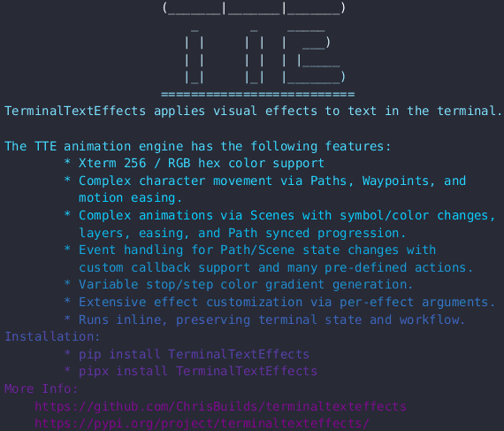

# Highlight



## Quick Start

``` py title="highlight.py"
from terminaltexteffects import Gradient
from terminaltexteffects.effects.effect_highlight import Highlight

effect = Highlight("YourTextHere")

with effect.terminal_output() as terminal:
    effect.effect_config.final_gradient_direction = Gradient.Direction.HORIZONTAL
    for frame in effect:
        terminal.print(frame)
```

## Highlight Directions and Sorts

`--highlight-direction` accepts every `CharacterOrder`. Group directions activate
whole rows, columns, diagonals, or radial bands. Sort directions activate individual characters in the
exact order returned by `Terminal.get_characters()`, using their input coordinates. All text remains
visible while the highlight travels through it.

The spiral sorts wind inward from the input's bounds:

| Clockwise | Counterclockwise | Starting corners |
| --- | --- | --- |
| `spiral_clockwise` | `spiral_counter_clockwise` | Top-left |
| `spiral_clockwise_double` | `spiral_counter_clockwise_double` | Top-left and bottom-right |
| `spiral_clockwise_quad` | `spiral_counter_clockwise_quad` | All four corners |

Double and quad spirals interleave their arms in the character sequence. Both grouped and sorted
modes retain the same easing schedule, so multiple characters may start highlighting in one frame.
`highlight_width` controls the duration of each character's bright highlight; it does not set the
number of characters in a sorted trail. The default remains `diagonal_bottom_left_to_top_right`.

```sh
tte highlight --highlight-direction spiral_clockwise
tte highlight --highlight-direction spiral_counter_clockwise_quad --highlight-width 12
```

Use `--reverse-highlight-direction` to reverse the complete traversal while preserving group membership.
The flag defaults to off. Reversed spirals travel outward along the selected path; changing
clockwise to counterclockwise instead selects a different inward path.

```sh
tte highlight --highlight-direction spiral_clockwise --reverse-highlight-direction
```

Configurations normalize to `CharacterOrder`. Existing `CharacterGroup` and `CharacterSort`
values and their CLI spellings remain accepted as compatibility inputs.

For library use, assign a native enum or its CLI spelling:

```python
from terminaltexteffects.effects.effect_highlight import Highlight
from terminaltexteffects import CharacterOrder

effect = Highlight("YourTextHere")
effect.effect_config.highlight_direction = CharacterOrder.SPIRAL_CLOCKWISE_DOUBLE
```

::: terminaltexteffects.effects.effect_highlight
