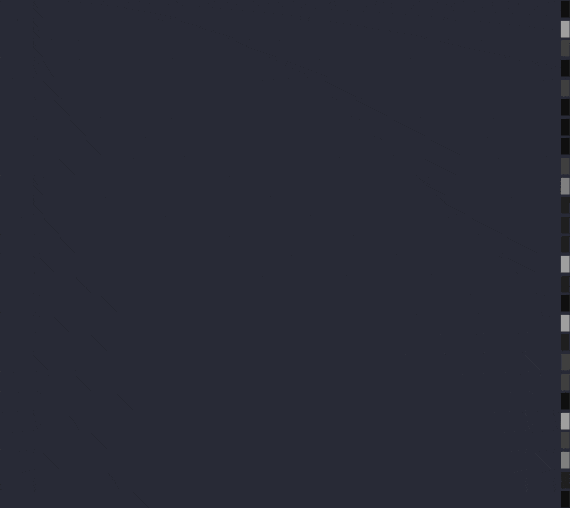

# Sweep



## Quick Start

``` py title="sweep.py"
import terminaltexteffects as tte
from terminaltexteffects.effects.effect_sweep import Sweep

effect = Sweep("YourTextHere")
effect.effect_config.final_gradient_direction = tte.Gradient.Direction.HORIZONTAL
with effect.terminal_output() as terminal:
    for frame in effect:
        terminal.print(frame)
```

## Sweep Directions and Sorts

`--first-sweep-direction` and `--second-sweep-direction` each accept every `CharacterOrder`. The first sweep reveals the text with a gray shimmer; the second colors it.
You can choose a group direction for one phase and a sort for the other, or use separate sorts
for both phases. The defaults remain `column_right_to_left` and `column_left_to_right`.

Group directions activate whole spatial bands. Sort directions activate individual characters in
the exact order returned by `Terminal.get_characters()`. Both phases include inner and outer fill
characters, so spiral sorts cover the canvas bounds, including blank space around the input.

| Clockwise | Counterclockwise | Starting corners |
| --- | --- | --- |
| `spiral_clockwise` | `spiral_counter_clockwise` | Top-left |
| `spiral_clockwise_double` | `spiral_counter_clockwise_double` | Top-left and bottom-right |
| `spiral_clockwise_quad` | `spiral_counter_clockwise_quad` | All four corners |

Double and quad spirals interleave their arms in the character sequence. Both grouped and sorted
modes retain the same easing schedule; several characters may activate in one frame. Each phase
starts its own sequence, and the final frame restores input symbols and clears the fill characters.

## Travel Speed

`--travel-speed` advances both sweep phases by the specified number of easing steps per frame.
It accepts a positive integer and defaults to `1`, preserving the original pacing. Higher values
activate more characters or complete spatial groups per frame while retaining the easing curve,
selected order, and reversal. The exact activation count varies along the easing curve.

Each phase retains its 100-step schedule, so speed `4` finishes scheduling a phase in 25 frames.
The second phase starts on the following frame, and active character animations still advance
once per frame and finish normally. This differs from Waves, where travel speed counts ordered
entries rather than easing steps.

```sh
tte sweep --first-sweep-direction spiral_clockwise --second-sweep-direction spiral_counter_clockwise
tte sweep --first-sweep-direction spiral_clockwise --second-sweep-direction spiral_counter_clockwise --travel-speed 8
tte sweep --first-sweep-direction column_right_to_left --second-sweep-direction spiral_clockwise_quad
```

Use `--reverse-first-sweep-direction` and `--reverse-second-sweep-direction` to reverse each
phase independently. Group membership is preserved, and both flags default to off.

```sh
tte sweep --first-sweep-direction spiral_clockwise --reverse-first-sweep-direction \
  --second-sweep-direction circle_center_to_outside --reverse-second-sweep-direction
```

Configurations normalize to `CharacterOrder`. Existing `CharacterGroup` and `CharacterSort`
values and their CLI spellings remain accepted as compatibility inputs.

For library use, assign native enums or their CLI spellings:

```python
from terminaltexteffects.effects.effect_sweep import Sweep
from terminaltexteffects import CharacterOrder

effect = Sweep("YourTextHere")
effect.effect_config.first_sweep_direction = CharacterOrder.COLUMN_RIGHT_TO_LEFT
effect.effect_config.second_sweep_direction = CharacterOrder.SPIRAL_CLOCKWISE_DOUBLE
effect.effect_config.travel_speed = 8
```

::: terminaltexteffects.effects.effect_sweep
