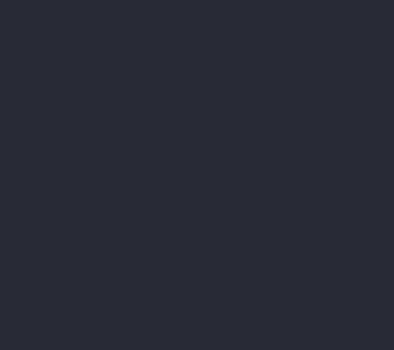

# Waves



## Quick Start

``` py title="waves.py"
from terminaltexteffects.effects.effect_waves import Waves

effect = Waves("YourTextHere")
with effect.terminal_output() as terminal:
    for frame in effect:
        terminal.print(frame)
```

## Circular Waves

The default direction, `circle_center_to_outside`, spreads waves outward in circular rings. Use
`circle_outside_to_center` for waves that converge on the text center. These directions account for
terminal character proportions. The existing `diamonds_center_to_outside` and `diamonds_outside_to_center` directions
use diamond-shaped groups. The former `center_to_outside` and `outside_to_center` spellings remain
accepted as compatibility aliases.

```sh
tte waves --wave-direction circle_center_to_outside
tte waves --wave-direction circle_outside_to_center
```

## Character Orders and Reversal

`--wave-direction` accepts every `CharacterOrder`: rows, columns, diagonals, diamond and circular
bands, individual row traversals, random order, and all six spiral patterns. By default, spatial orders
activate one complete group per frame and individual orders activate one character per frame.
Double and quad spiral arms interleave in that individual character sequence.
The default remains `circle_center_to_outside`.

Use `--reverse-wave-direction` to reverse activation order while retaining each group's membership.
Reversed spirals travel outward along the selected path. Reversal defaults to off.

```sh
tte waves --wave-direction spiral_clockwise_quad
tte waves --wave-direction spiral_counter_clockwise_double --reverse-wave-direction --travel-speed 8
```

```python
from terminaltexteffects import CharacterOrder
from terminaltexteffects.effects.effect_waves import Waves

effect = Waves("YourTextHere")
effect.effect_config.wave_direction = CharacterOrder.SPIRAL_CLOCKWISE
effect.effect_config.reverse_wave_direction = True
effect.effect_config.travel_speed = 8
```

CLI names, including the previous eight directions, and legacy `CharacterGroup` / `CharacterSort`
values normalize to `CharacterOrder`. The circular default and grouped activation timing at speed `1` are unchanged.

## Travel Speed

`--travel-speed` sets how many ordered entries activate per frame. For individual orders this is the
number of characters; for spatial orders it is the number of complete groups. The value must be a
positive integer and defaults to `1`. The last batch activates only the remaining entries, retaining
the selected order and reversal. Animation timing still advances once per frame.

```sh
tte waves --wave-direction spiral_clockwise --travel-speed 12
tte waves --wave-direction circle_center_to_outside --travel-speed 2
```

Use `--wave-length` to change the duration of each character's wave animation; `--travel-speed`
controls how quickly new characters or groups start their waves.

::: terminaltexteffects.effects.effect_waves
