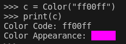

# Color

*Module*: `terminaltexteffects.utils.graphics`

## Basic Usage

Color objects are used to represent colors throughout TTE. However, they can be instantiated and printed directly.

### Supports Multiple Specification Formats

```python
from terminaltexteffects.utils.graphics import Color

red = Color('ff0000')
xterm_red = Color(9)
rgb_red_again = Color('#ff0000')
```

### Printing Colors

Colors can be printed to show the code and resulting color appearance.

```python
from terminaltexteffects.utils.graphics import Color

red = Color("ff0000")
print(red)
```



### Using Colors to build a Gradient

```python
from terminaltexteffects.utils.graphics import Gradient, Color

rgb = Gradient(Color("ff0000"), Color("00ff00"), Color("0000ff"), steps=5)
for color in rgb:
    # color is a hex string
    ...
```

### Passing Colors to effect configurations

```python
text = ("EXAMPLE" * 10 + "\n") * 10
red = Color("ff0000")
green = Color("00ff00")
blue = Color("0000ff")
effect = ColorShift(text)
effect.effect_config.gradient_stops = (red, green, blue)
with effect.terminal_output() as terminal:
    for frame in effect:
        terminal.print(frame)
```

::: terminaltexteffects.utils.graphics.Color
