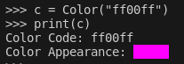

# Color

*Module*: `terminaltexteffects.utils.graphics`

## Basic Usage

`Color` objects represent colors throughout TTE. They are immutable and hashable, so they can safely be reused as
dictionary keys and configuration values.

### Supports Multiple Specification Formats

```python
from terminaltexteffects.utils.graphics import Color

red = Color("ff0000")
xterm_red = Color(9)
rgb_red_again = Color("#FF0000")
```

RGB strings must contain exactly six hexadecimal digits and may have one leading `#`. They are normalized to lowercase
without the leading hash. XTerm colors must be non-boolean integers from `0` through `255`. Invalid values raise
`ValueError`.

`rgb_color` exposes the normalized six-digit string, `rgb_ints` exposes its three integer channels, and `xterm_color`
contains the original XTerm index or `None` for an RGB specification.

### Equality and Hashing

Equality preserves the normalized color *specification*, not only its displayed RGB value:

```python
from terminaltexteffects.utils.graphics import Color

assert Color("#FF0000") == Color("ff0000")
assert Color(9) != Color("ff0000")
```

The second comparison is unequal even though XTerm color `9` converts to the same RGB value. Keeping XTerm provenance
distinct lets terminal output continue to choose between XTerm and RGB escape sequences.

### Printing Colors

Colors can be printed to show the code and resulting color appearance.

```python
from terminaltexteffects.utils.graphics import Color

red = Color("#ff0000")
print(red)
```



### Using Colors to Build a Gradient

```python
from terminaltexteffects.utils.graphics import Color, Gradient

rgb = Gradient(Color("#ff0000"), Color("#00ff00"), Color("#0000ff"), steps=5)
for color in rgb:
    assert isinstance(color, Color)
    print(color.rgb_color)
```

### Shifting Between Colors

`shift_color_towards()` accepts a factor from `0` through `1` and uses the same nearest, ties-to-even channel rounding
as gradient generation:

```python
from terminaltexteffects.utils.graphics import Color, shift_color_towards

midpoint = shift_color_towards(Color("000000"), Color("ffffff"), 0.5)
assert midpoint == Color("808080")
```

An out-of-range or non-finite factor raises `ValueError`.

### Passing Colors to Effect Configurations

```python
from terminaltexteffects.effects.effect_colorshift import ColorShift
from terminaltexteffects.utils.graphics import Color

text = ("EXAMPLE" * 10 + "\n") * 10
red = Color("#ff0000")
green = Color("#00ff00")
blue = Color("#0000ff")
effect = ColorShift(text)
effect.effect_config.gradient_stops = (red, green, blue)
with effect.terminal_output() as terminal:
    for frame in effect:
        terminal.print(frame)
```

---

## Color Reference

::: terminaltexteffects.utils.graphics.Color
