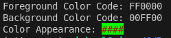

# ColorPair

*Module*: `terminaltexteffects.utils.graphics`

## Basic Usage

`ColorPair` objects are immutable foreground/background color pairs. The canonical fields are `fg` and `bg`; either
field may be `None` to leave that channel unset.

### Usage

```python
import terminaltexteffects as tte

color_pair = tte.ColorPair(fg=tte.Color("#FF0000"), bg=tte.Color("#00FF00"))
```

### Foreground-Only and Background-Only Pairs

```python
import terminaltexteffects as tte

foreground_only = tte.ColorPair(fg=tte.Color("#FF0000"))
background_only = tte.ColorPair(bg=tte.Color("#0000FF"))

assert foreground_only.bg is None
assert background_only.fg is None
```

### Automatic Color Conversion

Colors can be specified using strings or integers. Color objects will be created automatically.

```python
import terminaltexteffects as tte

foreground_only = tte.ColorPair(fg="#FF0000")
background_only = tte.ColorPair(bg=21)
color_pair = tte.ColorPair("#FF0000", "#00FF00")
```

Strings and integers are converted to `Color` objects. Both arguments are optional and default to `None`; invalid
color values raise the same `ValueError` as direct `Color` construction.

### Printing ColorPairs

ColorPair objects can be printed to see the resulting colors.



---

## ColorPair Reference

::: terminaltexteffects.utils.graphics.ColorPair
