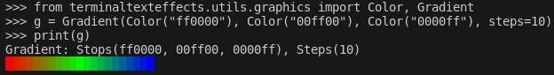

# Gradient

*Module*: `terminaltexteffects.utils.graphics`

## Basic Usage

```python
from terminaltexteffects.utils.graphics import Color, Gradient

rgb = Gradient(Color("#ff0000"), Color("#00ff00"), Color("#0000ff"), steps=5)
for color in rgb:
    assert isinstance(color, Color)
    print(color.rgb_color)
```

Iteration and indexing return `Color` objects. Use `color.rgb_color` when a six-digit RGB string is needed.

## Stops, Steps, and Loops

Provide one or more `Color` stops. A step count is the number of transitions between two adjacent stops, so a
two-stop gradient with `steps=4` contains five colors, including both stops:

```python
from terminaltexteffects.utils.graphics import Color, Gradient

gradient = Gradient(Color("000000"), Color("ffffff"), steps=4)
assert [color.rgb_color for color in gradient] == [
    "000000",
    "404040",
    "808080",
    "bfbfbf",
    "ffffff",
]
```

A single integer applies to every transition. A tuple assigns counts in stop-pair order; when it is shorter than the
number of transitions, its final value is repeated. A tuple cannot be empty or longer than the number of transitions,
and every count must be a positive, non-boolean integer. A single-stop gradient always contains that one stop after
validating its step values.

With `loop=True`, a gradient with multiple stops adds a final transition from the last stop back to the first. The
first stop therefore also appears as the final spectrum color:

```python
loop = Gradient(Color("ffffff"), Color("000000"), steps=(2, 3), loop=True)
assert [color.rgb_color for color in loop] == [
    "ffffff",
    "808080",
    "000000",
    "555555",
    "aaaaaa",
    "ffffff",
]
```

Invalid stops raise `TypeError`. Missing stops, invalid step counts, and overlong step tuples raise `ValueError`.

## Fractional Lookup

`get_color_at_fraction()` accepts a finite number from `0` through `1` and selects the nearest precomputed spectrum
sample. Half-sample ties use Python's ties-to-even `round()` behavior. Non-numeric values raise `TypeError`; non-finite
or out-of-range values raise `ValueError`.

## Coordinate Mappings

Coordinate mappings include every row and column bound and return `dict[Coord, Color]`:

```python
from terminaltexteffects.utils.geometry import Coord
from terminaltexteffects.utils.graphics import Color, Gradient

gradient = Gradient(Color("000000"), Color("ffffff"), steps=2)
mapping = gradient.build_coordinate_color_mapping(
    min_row=1,
    max_row=1,
    min_column=4,
    max_column=6,
    direction=Gradient.Direction.HORIZONTAL,
)

assert [mapping[Coord(column, 1)].rgb_color for column in range(4, 7)] == [
    "000000",
    "808080",
    "ffffff",
]
```

- `HORIZONTAL` maps the first and final colors to `min_column` and `max_column`.
- `VERTICAL` maps the first and final colors to `min_row` and `max_row`.
- `DIAGONAL` maps the first color at `(min_column, min_row)` and the final color at `(max_column, max_row)`.
- `RADIAL` measures from the rectangle's geometric center toward its corners; the center is fraction `0` and every
  corner is fraction `1`.

A direction with no span uses the first color. Bounds must be non-boolean integers greater than zero, each minimum must
not exceed its maximum, and `direction` must be a `Gradient.Direction`. Invalid bound types or directions raise
`TypeError`; invalid bound values raise `ValueError`.

## Printing Gradients

Gradients can be printed to the terminal to show information about the stops, steps, and resulting spectrum.



---

## Gradient Reference

::: terminaltexteffects.utils.graphics.Gradient
