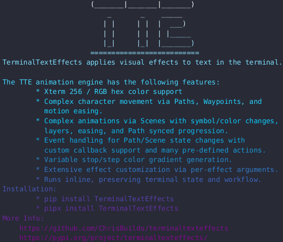

# Effects Showroom

The effects shown below represent the built-in library of effects and their default configuration.

## Beams

Creates beams which travel over the canvas illuminating the characters.


[Reference](./effects/beams.md){ .md-button } [Config](./effects/beams.md#terminaltexteffects.effects.effect_beams.BeamsConfig){ .md-button }

??? example "Beams Command Line Arguments"

    ```
    --beam-row-symbols (ASCII/UTF-8 character) [(ASCII/UTF-8 character) ...]
                        Symbols to use for the beam effect when moving along a row. Strings will be used in sequence to create an animation. (default: ('▂', '▁', '_'))
    --beam-column-symbols (ASCII/UTF-8 character) [(ASCII/UTF-8 character) ...]
                        Symbols to use for the beam effect when moving along a column. Strings will be used in sequence to create an animation. (default: ('▌', '▍', '▎', '▏'))
    --beam-delay (int > 0)
                        Number of frames to wait before adding the next group of beams. Beams are added in groups of size random(1, 5). (default: 10)
    --beam-row-speed-range (hyphen separated int range e.g. '1-10')
                        Minimum speed of the beam when moving along a row. (default: (10, 40))
    --beam-column-speed-range (hyphen separated int range e.g. '1-10')
                        Minimum speed of the beam when moving along a column. (default: (6, 10))
    --beam-gradient-stops (XTerm [0-255] OR RGB Hex [000000-ffffff]) [(XTerm [0-255] OR RGB Hex [000000-ffffff]) ...]
                        Space separated, unquoted, list of colors for the beam, a gradient will be created between the colors. (default: ('ffffff', '00D1FF', '8A008A'))
    --beam-gradient-steps (int > 0) [(int > 0) ...]
                        Space separated, unquoted, numbers for the of gradient steps to use. More steps will create a smoother and longer gradient animation. Steps are paired with the colors in final-gradient-
                        stops. (default: (2, 8))
    --beam-gradient-frames (int > 0)
                        Number of frames to display each gradient step. Increase to slow down the gradient animation. (default: 2)
    --final-gradient-stops (XTerm [0-255] OR RGB Hex [000000-ffffff]) [(XTerm [0-255] OR RGB Hex [000000-ffffff]) ...]
                        Space separated, unquoted, list of colors for the wipe gradient. (default: ('8A008A', '00D1FF', 'ffffff'))
    --final-gradient-steps (int > 0) [(int > 0) ...]
                        Space separated, unquoted, numbers for the of gradient steps to use. More steps will create a smoother and longer gradient animation. Steps are paired with the colors in final-gradient-
                        stops. (default: (12,))
    --final-gradient-frames (int > 0)
                        Number of frames to display each gradient step. Increase to slow down the gradient animation. (default: 5)
    --final-gradient-direction (diagonal, horizontal, vertical, radial)
                        Direction of the final gradient. (default: Direction.VERTICAL)
    --final-wipe-speed (int > 0)
                        Speed of the final wipe as measured in diagonal groups activated per frame. (default: 1)

    Example: terminaltexteffects beams --beam-row-symbols ▂ ▁ _ --beam-column-symbols ▌ ▍ ▎ ▏ --beam-delay 10 --beam-row-speed-range 10-40 --beam-column-speed-range 6-10 --beam-gradient-stops ffffff 00D1FF 8A008A --beam-gradient-steps 2 8 --beam-gradient-frames 2 --final-gradient-stops 8A008A 00D1FF ffffff --final-gradient-steps 12 --final-gradient-frames 5 --final-gradient-direction vertical --final-wipe-speed 1
    ```
---

## Binarypath

Decodes characters into their binary form. Characters travel from outside the canvas towards their input coordinate, moving at right angles.


[Reference](./effects/binarypath.md){ .md-button } [Config](./effects/binarypath.md#terminaltexteffects.effects.effect_binarypath.BinaryPathConfig){ .md-button }

??? example "Binarypath Command Line Arguments"

    ```
    --final-gradient-stops (XTerm [0-255] OR RGB Hex [000000-ffffff]) [(XTerm [0-255] OR RGB Hex [000000-ffffff]) ...]
                        Space separated, unquoted, list of colors for the character gradient (applied from bottom to top). If only one color is provided, the characters will be displayed in that color.
                        (default: ('00d500', '007500'))
    --final-gradient-steps (int > 0) [(int > 0) ...]
                        Space separated, unquoted, list of the number of gradient steps to use. More steps will create a smoother and longer gradient animation. (default: (12,))
    --final-gradient-direction (diagonal, horizontal, vertical, radial)
                        Direction of the final gradient. (default: Direction.CENTER)
    --binary-colors (XTerm [0-255] OR RGB Hex [000000-ffffff]) [(XTerm [0-255] OR RGB Hex [000000-ffffff]) ...]
                        Space separated, unquoted, list of colors for the binary characters. Character color is randomly assigned from this list. (default: ('044E29', '157e38', '45bf55', '95ed87'))
    --movement-speed (float > 0)
                        Speed of the binary groups as they travel around the terminal. (default: 1.0)
    --active-binary-groups (0 <= float(n) <= 1)
                        Maximum number of binary groups that are active at any given time. Lower this to improve performance. (default: 0.05)

    Example: terminaltexteffects binarypath --final-gradient-stops 00d500 007500 --final-gradient-steps 12 --final-gradient-direction vertical --binary-colors 044E29 157e38 45bf55 95ed87 --movement-speed 1.0 --active-binary-groups 0.05
    ```
---

## Blackhole

Creates a blackhole in a starfield, consumes the stars, explodes the input data back into position.


[Reference](./effects/blackhole.md){ .md-button } [Config](./effects/blackhole.md#terminaltexteffects.effects.effect_blackhole.BlackholeConfig){ .md-button }

??? example "Blackhole Command Line Arguments"

    ```
    --blackhole-color (XTerm [0-255] OR RGB Hex [000000-ffffff])
                        Color for the stars that comprise the blackhole border. (default: ffffff)
    --star-colors (XTerm [0-255] OR RGB Hex [000000-ffffff]) [(XTerm [0-255] OR RGB Hex [000000-ffffff]) ...]
                        List of colors from which character colors will be chosen and applied after the explosion, but before the cooldown to final color. (default: ('ffcc0d', 'ff7326', 'ff194d', 'bf2669',
                        '702a8c', '049dbf'))
    --final-gradient-stops (XTerm [0-255] OR RGB Hex [000000-ffffff]) [(XTerm [0-255] OR RGB Hex [000000-ffffff]) ...]
                        Space separated, unquoted, list of colors for the character gradient (applied from bottom to top). If only one color is provided, the characters will be displayed in that color.
                        (default: ('8A008A', '00D1FF', 'ffffff'))
    --final-gradient-steps (int > 0) [(int > 0) ...]
                        Space separated, unquoted, list of the number of gradient steps to use. More steps will create a smoother and longer gradient animation. (default: (12,))
    --final-gradient-direction (diagonal, horizontal, vertical, radial)
                        Direction of the final gradient. (default: Direction.DIAGONAL)

    Example: terminaltexteffects blackhole --star-colors ffcc0d ff7326 ff194d bf2669 702a8c 049dbf --final-gradient-stops 8A008A 00D1FF FFFFFF --final-gradient-steps 12 --final-gradient-direction vertical
    ```
---

## BouncyBalls

Characters fall from the top of the canvas as bouncy balls before settling into place.


[Reference](./effects/bouncyballs.md){ .md-button } [Config](./effects/bouncyballs.md#terminaltexteffects.effects.effect_bouncyballs.BouncyBallsConfig){ .md-button }

??? example "Bouncyballs Command Line Arguments"

    ```
    --ball-colors (XTerm [0-255] OR RGB Hex [000000-ffffff]) [(XTerm [0-255] OR RGB Hex [000000-ffffff]) ...]
                        Space separated list of colors from which ball colors will be randomly selected. If no colors are provided, the colors are random. (default: ('d1f4a5', '96e2a4', '5acda9'))
    --ball-symbols (ASCII/UTF-8 character) [(ASCII/UTF-8 character) ...]
                        Space separated list of symbols to use for the balls. (default: ('*', 'o', 'O', '0', '.'))
    --final-gradient-stops (XTerm [0-255] OR RGB Hex [000000-ffffff]) [(XTerm [0-255] OR RGB Hex [000000-ffffff]) ...]
                        Space separated, unquoted, list of colors for the character gradient (applied from bottom to top). If only one color is provided, the characters will be displayed in that color.
                        (default: ('f8ffae', '43c6ac'))
    --final-gradient-steps (int > 0) [(int > 0) ...]
                        Space separated, unquoted, list of the number of gradient steps to use. More steps will create a smoother and longer gradient animation. (default: (12,))
    --final-gradient-direction (diagonal, horizontal, vertical, radial)
                        Direction of the final gradient. (default: Direction.DIAGONAL)
    --ball-delay (int >= 0)
                        Number of frames between ball drops, increase to reduce ball drop rate. (default: 7)
    --movement-speed (float > 0)
                        Movement speed of the characters.  (default: 0.25)
    --easing EASING       Easing function to use for character movement. (default: out_bounce)

    Easing
    ------
    Note: A prefix must be added to the function name.

    All easing functions support the following prefixes:
        IN_  - Ease in
        OUT_ - Ease out
        IN_OUT_ - Ease in and out
        
    Easing Functions
    ----------------
    SINE   - Sine easing
    QUAD   - Quadratic easing
    CUBIC  - Cubic easing
    QUART  - Quartic easing
    QUINT  - Quintic easing
    EXPO   - Exponential easing
    CIRC   - Circular easing
    BACK   - Back easing
    ELASTIC - Elastic easing
    BOUNCE - Bounce easing

    Visit: https://easings.net/ for visualizations of the easing functions.

    Example: terminaltexteffects bouncyballs --ball-colors d1f4a5 96e2a4 5acda9 --ball-symbols o "*" O 0 . --final-gradient-stops f8ffae 43c6ac --final-gradient-steps 12 --final-gradient-direction diagonal --ball-delay 7 --movement-speed 0.25 --easing OUT_BOUNCE
    ```
---

## Bubbles

Forms bubbles with the characters. Bubbles float down and pop.


[Reference](./effects/bubbles.md){ .md-button } [Config](./effects/bubbles.md#terminaltexteffects.effects.effect_bubbles.BubblesConfig){ .md-button }

??? example "Bubbles Command Line Arguments"

    ```
    --rainbow             If set, the bubbles will be colored with a rotating rainbow gradient. (default: False)
    --bubble-colors (XTerm [0-255] OR RGB Hex [000000-ffffff]) [(XTerm [0-255] OR RGB Hex [000000-ffffff]) ...]
                        Space separated, unquoted, list of colors for the bubbles. Ignored if --no-rainbow is left as default False. (default: ('d33aff', '7395c4', '43c2a7', '02ff7f'))
    --pop-color (XTerm [0-255] OR RGB Hex [000000-ffffff])
                        Color for the spray emitted when a bubble pops. (default: ffffff)
    --final-gradient-stops (XTerm [0-255] OR RGB Hex [000000-ffffff]) [(XTerm [0-255] OR RGB Hex [000000-ffffff]) ...]
                        Space separated, unquoted, list of colors for the character gradient (applied from bottom to top). If only one color is provided, the characters will be displayed in that color.
                        (default: ('d33aff', '02ff7f'))
    --final-gradient-steps (int > 0) [(int > 0) ...]
                        Space separated, unquoted, list of the number of gradient steps to use. More steps will create a smoother and longer gradient animation. (default: (12,))
    --final-gradient-direction (diagonal, horizontal, vertical, radial)
                        Direction of the final gradient. (default: Direction.DIAGONAL)
    --bubble-speed (float > 0)
                        Speed of the floating bubbles.  (default: 0.1)
    --bubble-delay (int > 0)
                        Number of frames between bubbles. (default: 50)
    --pop-condition {row,bottom,anywhere}
                        Condition for a bubble to pop. 'row' will pop the bubble when it reaches the the lowest row for which a character in the bubble originates. 'bottom' will pop the bubble at the bottom
                        row of the terminal. 'anywhere' will pop the bubble randomly, or at the bottom of the terminal. (default: row)
    --easing (Easing Function)
                        Easing function to use for character movement after a bubble pops. (default: in_out_sine)

    Easing
    ------
    Note: A prefix must be added to the function name.

    All easing functions support the following prefixes:
        IN_  - Ease in
        OUT_ - Ease out
        IN_OUT_ - Ease in and out
        
    Easing Functions
    ----------------
    SINE   - Sine easing
    QUAD   - Quadratic easing
    CUBIC  - Cubic easing
    QUART  - Quartic easing
    QUINT  - Quintic easing
    EXPO   - Exponential easing
    CIRC   - Circular easing
    BACK   - Back easing
    ELASTIC - Elastic easing
    BOUNCE - Bounce easing

    Visit: https://easings.net/ for visualizations of the easing functions.

    Example: terminaltexteffects bubbles --bubble-colors d33aff 7395c4 43c2a7 02ff7f --pop-color ffffff --final-gradient-stops d33aff 02ff7f --final-gradient-steps 12 --final-gradient-direction diagonal --bubble-speed 0.1 --bubble-delay 50 --pop-condition row --easing IN_OUT_SINE
    ```
---

## Burn

Characters are ignited and burn up the screen.


[Reference](./effects/burn.md){ .md-button } [Config](./effects/burn.md#terminaltexteffects.effects.effect_burn.BurnConfig){ .md-button }

??? example "Burn Command Line Arguments"

    ```
    --starting-color (XTerm [0-255] OR RGB Hex [000000-ffffff])
                        Color of the characters before they start to burn. (default: 837373)
    --burn-colors (XTerm [0-255] OR RGB Hex [000000-ffffff]) [(XTerm [0-255] OR RGB Hex [000000-ffffff]) ...]
                        Colors transitioned through as the characters burn. (default: ('ffffff', 'fff75d', 'fe650d', '8A003C', '510100'))
    --final-gradient-stops (XTerm [0-255] OR RGB Hex [000000-ffffff]) [(XTerm [0-255] OR RGB Hex [000000-ffffff]) ...]
                        Space separated, unquoted, list of colors for the character gradient (applied from bottom to top). If only one color is provided, the characters will be displayed in that color.
                        (default: ('00c3ff', 'ffff1c'))
    --final-gradient-steps (int > 0) [(int > 0) ...]
                        Space separated, unquoted, list of the number of gradient steps to use. More steps will create a smoother and longer gradient animation. (default: (12,))
    --final-gradient-direction (diagonal, horizontal, vertical, radial)
                        Direction of the final gradient. (default: Direction.VERTICAL)

    Example: terminaltexteffects burn --starting-color 837373 --burn-colors ffffff fff75d fe650d 8a003c 510100 --final-gradient-stops 00c3ff ffff1c --final-gradient-steps 12
    ```
---

## ColorShift

Display a gradient that shifts colors across the terminal.


!!! note

    Demo GIF uses `--travel` and `--travel-direction radial` arguments.

[Reference](./effects/colorshift.md){ .md-button } [Config](./effects/colorshift.md#terminaltexteffects.effects.effect_colorshift.ColorShiftConfig){ .md-button }

??? example "ColorShift Command Line Arguments"

    ```
    --gradient-stops (XTerm [0-255] OR RGB Hex [000000-ffffff]) [(XTerm [0-255] OR RGB Hex [000000-ffffff]) ...]
                    Space separated, unquoted, list of colors for the gradient. (default: (Color('e81416'),
                    Color('ffa500'), Color('faeb36'), Color('79c314'), Color('487de7'), Color('4b369d'),
                    Color('70369d')))
    --gradient-steps (int > 0) [(int > 0) ...]
                    Number of gradient steps to use. More steps will create a smoother gradient animation.
                    (default: 12)
    --gradient-frames (int > 0)
                    Number of frames to display each gradient step. Increase to slow down the gradient
                    animation. (default: 5)
    --travel              Display the gradient as a traveling wave (default: False)
    --travel-direction (diagonal, horizontal, vertical, radial)
                    Direction the gradient travels across the canvas. (default: Direction.HORIZONTAL)
    --reverse-travel-direction
                    Reverse the gradient travel direction. (default: False)
    --no-loop             Do not loop the gradient. If not set, the gradient generation will loop the final gradient
                    color back to the first gradient color. (default: False)
    --cycles (int > 0)    Number of times to cycle the gradient. (default: 3)
    --skip-final-gradient
                    Skip the final gradient. (default: False)
    --final-gradient-stops (XTerm [0-255] OR RGB Hex [000000-ffffff]) [(XTerm [0-255] OR RGB Hex [000000-ffffff]) ...]
                    Space separated, unquoted, list of colors for the character gradient (applied from bottom
                    to top). If only one color is provided, the characters will be displayed in that color.
                    (default: (Color('e81416'), Color('ffa500'), Color('faeb36'), Color('79c314'),
                    Color('487de7'), Color('4b369d'), Color('70369d')))
    --final-gradient-steps (int > 0) [(int > 0) ...]
                    Space separated, unquoted, list of the number of gradient steps to use. More steps will
                    create a smoother and longer gradient animation. (default: 12)
    --final-gradient-direction (diagonal, horizontal, vertical, radial)
                    Direction of the final gradient. (default: Direction.VERTICAL)

    Example: terminaltexteffects colorshift --gradient-stops 0000ff ffffff 0000ff --gradient-steps 12 --gradient-frames 10 --cycles 3 --travel --travel-direction radial --final-gradient-stops 00c3ff ffff1c --final-gradient-steps 12
    ```
---

## Crumble

Characters crumble into dust before being vacuumed up and reformed.


[Reference](./effects/crumble.md){ .md-button } [Config](./effects/crumble.md#terminaltexteffects.effects.effect_crumble.CrumbleConfig){ .md-button }

??? example "Crumble Command Line Arguments"

    ```
    --final-gradient-stops (XTerm [0-255] OR RGB Hex [000000-ffffff]) [(XTerm [0-255] OR RGB Hex [000000-ffffff]) ...]
                        Space separated, unquoted, list of colors for the character gradient (applied from bottom to top). If only one color is provided, the characters will be displayed in that color.
                        (default: ('5CE1FF', 'FF8C00'))
    --final-gradient-steps (int > 0) [(int > 0) ...]
                        Space separated, unquoted, list of the number of gradient steps to use. More steps will create a smoother and longer gradient animation. (default: (12,))
    --final-gradient-direction (diagonal, horizontal, vertical, radial)
                        Direction of the final gradient. (default: Direction.DIAGONAL)

    Example: terminaltexteffects crumble --final-gradient-stops 5CE1FF FF8C00 --final-gradient-steps 12 --final-gradient-direction diagonal
    ```
---

## Decrypt

Movie style text decryption effect.


[Reference](./effects/decrypt.md){ .md-button } [Config](./effects/decrypt.md#terminaltexteffects.effects.effect_decrypt.DecryptConfig){ .md-button }

??? example "Decrypt Command Line Arguments"

    ```
    --typing-speed (int > 0)
                        Number of characters typed per keystroke. (default: 1)
    --ciphertext-colors (XTerm [0-255] OR RGB Hex [000000-ffffff]) [(XTerm [0-255] OR RGB Hex [000000-ffffff]) ...]
                        Space separated, unquoted, list of colors for the ciphertext. Color will be randomly selected for each character. (default: ('008000', '00cb00', '00ff00'))
    --final-gradient-stops (XTerm [0-255] OR RGB Hex [000000-ffffff]) [(XTerm [0-255] OR RGB Hex [000000-ffffff]) ...]
                        Space separated, unquoted, list of colors for the character gradient (applied from bottom to top). If only one color is provided, the characters will be displayed in that color.
                        (default: ('eda000',))
    --final-gradient-steps (int > 0) [(int > 0) ...]
                        Space separated, unquoted, list of the number of gradient steps to use. More steps will create a smoother and longer gradient animation. (default: (12,))
    --final-gradient-direction (diagonal, horizontal, vertical, radial)
                        Direction of the final gradient. (default: Direction.VERTICAL)

    Example: terminaltexteffects decrypt --typing-speed 2 --ciphertext-colors 008000 00cb00 00ff00 --final-gradient-stops eda000 --final-gradient-steps 12 --final-gradient-direction vertical
    ```
---

## ErrorCorrect

Swaps characters from an incorrect initial position to the correct position.


[Reference](./effects/errorcorrect.md){ .md-button } [Config](./effects/errorcorrect.md#terminaltexteffects.effects.effect_errorcorrect.ErrorCorrectConfig){ .md-button }

??? example "ErrorCorrect Command Line Arguments"

    ```
    --error-pairs (int > 0)
                            Percent of characters that are in the wrong position. This is a float between 0 and 1.0. 0.2 means 20 percent of the characters will be in the wrong position. (default: 0.1)
    --swap-delay (int > 0)
                            Number of frames between swaps. (default: 10)
    --error-color (XTerm [0-255] OR RGB Hex [000000-ffffff])
                            Color for the characters that are in the wrong position. (default: e74c3c)
    --correct-color (XTerm [0-255] OR RGB Hex [000000-ffffff])
                            Color for the characters once corrected, this is a gradient from error-color and fades to final-color. (default: 45bf55)
    --final-gradient-stops (XTerm [0-255] OR RGB Hex [000000-ffffff]) [(XTerm [0-255] OR RGB Hex [000000-ffffff]) ...]
                            Space separated, unquoted, list of colors for the character gradient (applied from bottom to top). If only one color is provided, the characters will be displayed in that color.
                            (default: ('8A008A', '00D1FF', 'FFFFFF'))
    --final-gradient-steps (int > 0) [(int > 0) ...]
                            Space separated, unquoted, list of the number of gradient steps to use. More steps will create a smoother and longer gradient animation. (default: (12,))
    --final-gradient-direction (diagonal, horizontal, vertical, radial)
                            Direction of the final gradient. (default: Direction.VERTICAL)
    --movement-speed (float > 0)
                            Speed of the characters while moving to the correct position. Valid values are n > 0. Adjust speed and animation rate separately to fine tune the
                            effect. (default: 0.5)

        Easing
        ------
        Note: A prefix must be added to the function name.
        
        All easing functions support the following prefixes:
            IN_  - Ease in
            OUT_ - Ease out
            IN_OUT_ - Ease in and out
            
        Easing Functions
        ----------------
        SINE   - Sine easing
        QUAD   - Quadratic easing
        CUBIC  - Cubic easing
        QUART  - Quartic easing
        QUINT  - Quintic easing
        EXPO   - Exponential easing
        CIRC   - Circular easing
        BACK   - Back easing
        ELASTIC - Elastic easing
        BOUNCE - Bounce easing
        
        Visit: https://easings.net/ for visualizations of the easing functions.

        
    Example: terminaltexteffects errorcorrect --error-pairs 0.1 --swap-delay 10 --error-color e74c3c --correct-color 45bf55 --final-gradient-stops 8A008A 00D1FF FFFFFF --final-gradient-steps 12 --movement-speed 0.5
    ```
---

## Expand

Characters expand from the center.


[Reference](./effects/expand.md){ .md-button } [Config](./effects/expand.md#terminaltexteffects.effects.effect_expand.ExpandConfig){ .md-button }

??? example "Expand Command Line Arguments"

    ```
    --final-gradient-stops (XTerm [0-255] OR RGB Hex [000000-ffffff]) [(XTerm [0-255] OR RGB Hex [000000-ffffff]) ...]
                        Space separated, unquoted, list of colors for the character gradient (applied from bottom to top). If only one color is provided, the characters will be displayed in that color.
                        (default: ('8A008A', '00D1FF', 'FFFFFF'))
    --final-gradient-steps (int > 0) [(int > 0) ...]
                        Space separated, unquoted, list of the number of gradient steps to use. More steps will create a smoother and longer gradient animation. (default: (12,))
    --final-gradient-frames (int > 0)
                        Number of frames to display each gradient step. Increase to slow down the gradient animation. (default: 5)
    --final-gradient-direction (diagonal, horizontal, vertical, radial)
                        Direction of the final gradient. (default: Direction.VERTICAL)
    --movement-speed (float > 0)
                        Movement speed of the characters.  (default: 0.35)
    --expand-easing EXPAND_EASING
                        Easing function to use for character movement. (default: in_out_quart)

    Easing
    ------
    Note: A prefix must be added to the function name.

    All easing functions support the following prefixes:
        IN_  - Ease in
        OUT_ - Ease out
        IN_OUT_ - Ease in and out
        
    Easing Functions
    ----------------
    SINE   - Sine easing
    QUAD   - Quadratic easing
    CUBIC  - Cubic easing
    QUART  - Quartic easing
    QUINT  - Quintic easing
    EXPO   - Exponential easing
    CIRC   - Circular easing
    BACK   - Back easing
    ELASTIC - Elastic easing
    BOUNCE - Bounce easing

    Visit: https://easings.net/ for visualizations of the easing functions.


    Example: terminaltexteffects expand --final-gradient-stops 8A008A 00D1FF FFFFFF --final-gradient-steps 12 --final-gradient-frames 5 --movement-speed 0.35 --expand-easing IN_OUT_QUART
    ```
---

## Fireworks

Launches characters up the screen where they explode like fireworks and fall into place.


[Reference](./effects/fireworks.md){ .md-button } [Config](./effects/fireworks.md#terminaltexteffects.effects.effect_fireworks.FireworksConfig){ .md-button }

??? example "Fireworks Command Line Arguments"

    ```
    --explode-anywhere    If set, fireworks explode anywhere in the canvas. Otherwise, fireworks explode above highest settled row of text. (default: False)
    --firework-colors (XTerm [0-255] OR RGB Hex [000000-ffffff]) [(XTerm [0-255] OR RGB Hex [000000-ffffff]) ...]
                        Space separated list of colors from which firework colors will be randomly selected. (default: ('88F7E2', '44D492', 'F5EB67', 'FFA15C', 'FA233E'))
    --firework-symbol (ASCII/UTF-8 character)
                        Symbol to use for the firework shell. (default: o)
    --firework-volume (0 <= float(n) <= 1)
                        Percent of total characters in each firework shell. (default: 0.02)
    --final-gradient-stops (XTerm [0-255] OR RGB Hex [000000-ffffff]) [(XTerm [0-255] OR RGB Hex [000000-ffffff]) ...]
                        Space separated, unquoted, list of colors for the character gradient (applied from bottom to top). If only one color is provided, the characters will be displayed in that color.
                        (default: ('8A008A', '00D1FF', 'FFFFFF'))
    --final-gradient-steps (int > 0) [(int > 0) ...]
                        Space separated, unquoted, list of the number of gradient steps to use. More steps will create a smoother and longer gradient animation. (default: (12,))
    --final-gradient-direction (diagonal, horizontal, vertical, radial)
                        Direction of the final gradient. (default: Direction.HORIZONTAL)
    --launch-delay (int >= 0)
                        Number of frames to wait between launching each firework shell. +/- 0-50 percent randomness is applied to this value. (default: 60)
    --explode-distance (0 <= float(n) <= 1)
                        Maximum distance from the firework shell origin to the explode waypoint as a percentage of the total canvas width. (default: 0.1)

    Example: terminaltexteffects fireworks --firework-colors 88F7E2 44D492 F5EB67 FFA15C FA233E --firework-symbol o --firework-volume 0.02 --final-gradient-stops 8A008A 00D1FF FFFFFF --final-gradient-steps 12 --launch-delay 60 --explode-distance 0.1 --explode-anywhere
    ```
---

## Highlight

Run a specular highlight across the text.



[Reference](./effects/highlight.md){ .md-button } [Config](./effects/highlight.md#terminaltexteffects.effects.effect_highlight.HighlightConfig){ .md-button }

??? example "Highlight Command Line Arguments"

    ```
    --highlight-brightness (float > 0)
                        Brightness of the highlight color. Values less than 1 will darken the highlight color,
                        while values greater than 1 will brighten the highlight color. (default: 1.75)
    --highlight-direction {column_left_to_right,column_right_to_left,row_top_to_bottom,row_bottom_to_top,diagonal_top_left_to_bottom_right,diagonal_bottom_left_to_top_right,diagonal_top_right_to_bottom_left,diagonal_bottom_right_to_top_left,outside_to_center,center_to_outside}
                        Direction the highlight will travel. (default: diagonal_bottom_left_to_top_right)
    --highlight-width (int > 0)
                        Width of the highlight. n >= 1 (default: 8)
    --final-gradient-stops (XTerm [0-255] OR RGB Hex [000000-ffffff]) [(XTerm [0-255] OR RGB Hex [000000-ffffff]) ...]
                        Space separated, unquoted, list of colors for the character gradient (applied from bottom
                        to top). If only one color is provided, the characters will be displayed in that color.
                        (default: (Color('8A008A'), Color('00D1FF'), Color('FFFFFF')))
    --final-gradient-steps (int > 0) [(int > 0) ...]
                        Space separated, unquoted, list of the number of gradient steps to use. More steps will
                        create a smoother and longer gradient animation. (default: 12)
    --final-gradient-direction (diagonal, horizontal, vertical, radial)
                        Direction of the final gradient. (default: Direction.VERTICAL)

    Example: terminaltexteffects highlight --highlight-brightness 1.5 --highlight-direction
    diagonal_bottom_left_to_top_right --highlight-width 8 --final-gradient-stops 8A008A 00D1FF FFFFFF --final-gradient-steps
    12 --final-gradient-direction vertical
    ```
---

## Matrix

Matrix digital rain effect.


[Reference](./effects/matrix.md){ .md-button } [Config](./effects/matrix.md#terminaltexteffects.effects.effect_matrix.MatrixConfig){ .md-button }

??? example "Matrix Command Line Arguments"

    ```
    --highlight-color (XTerm [0-255] OR RGB Hex [000000-ffffff])
                        Color for the bottom of the rain column. (default: Color Code: dbffdb Color Appearance: █████)
    --rain-color-gradient (XTerm [0-255] OR RGB Hex [000000-ffffff]) [(XTerm [0-255] OR RGB Hex [000000-ffffff]) ...]
                        Space separated, unquoted, list of colors for the rain gradient. Colors are selected from the gradient randomly. If only one color is provided, the characters will be displayed in that
                        color. (default: (Color(92be92), Color(185318)))
    --rain-symbols (ASCII/UTF-8 character) [(ASCII/UTF-8 character) ...]
                        Space separated, unquoted, list of symbols to use for the rain. (default: ('2', '5', '9', '8', 'Z', '*', ')', ':', '.', '"', '=', '+', '-', '¦', '|', '_', 'ｦ', 'ｱ', 'ｳ', 'ｴ', 'ｵ', 'ｶ',
                        'ｷ', 'ｹ', 'ｺ', 'ｻ', 'ｼ', 'ｽ', 'ｾ', 'ｿ', 'ﾀ', 'ﾂ', 'ﾃ', 'ﾅ', 'ﾆ', 'ﾇ', 'ﾈ', 'ﾊ', 'ﾋ', 'ﾎ', 'ﾏ', 'ﾐ', 'ﾑ', 'ﾒ', 'ﾓ', 'ﾔ', 'ﾕ', 'ﾗ', 'ﾘ', 'ﾜ'))
    --rain-fall-delay-range (hyphen separated int range e.g. '1-10')
                        Range for the speed of the falling rain as determined by the delay between rows. Actual delay is randomly selected from the range. (default: (8, 25))
    --rain-column-delay-range (hyphen separated int range e.g. '1-10')
                        Range of frames to wait between adding new rain columns. (default: (5, 15))
    --rain-time (int > 0)
                        Time, in seconds, to display the rain effect before transitioning to the input text. (default: 15)
    --symbol-swap-chance (float > 0)
                        Chance of swapping a character's symbol on each tick. (default: 0.005)
    --color-swap-chance (float > 0)
                        Chance of swapping a character's color on each tick. (default: 0.001)
    --resolve-delay (int > 0)
                        Number of frames to wait between resolving the next group of characters. This is used to adjust the speed of the final resolve phase. (default: 5)
    --final-gradient-stops (XTerm [0-255] OR RGB Hex [000000-ffffff]) [(XTerm [0-255] OR RGB Hex [000000-ffffff]) ...]
                        Space separated, unquoted, list of colors for the character gradient (applied from bottom to top). If only one color is provided, the characters will be displayed in that color.
                        (default: Color Code: 389c38 Color Appearance: █████)
    --final-gradient-steps (int > 0) [(int > 0) ...]
                        Space separated, unquoted, list of the number of gradient steps to use. More steps will create a smoother and longer gradient animation. (default: 12)
    --final-gradient-frames (int > 0)
                        Number of frames to display each gradient step. Increase to slow down the gradient animation. (default: 5)
    --final-gradient-direction (diagonal, horizontal, vertical, radial)
                        Direction of the final gradient. (default: Direction.VERTICAL)

    Example: tte matrix --rain-color-gradient 92be92 185318 --rain-symbols 2 5 9 8 Z : . = + - ¦ _ --rain-fall-delay-range
    8-25 --rain-column-delay-range 5-15 --rain-time 15 --symbol-swap-chance 0.005 --color-swap-chance 0.001 --resolve-delay
    5 --final-gradient-stops 389c38 --final-gradient-steps 12 --final-gradient-frames 5 --final-gradient-direction vertical
    --highlight-color dbffdb    
    ```

---

## MiddleOut

Text expands in a single row or column in the middle of the canvas then out.


[Reference](./effects/middleout.md){ .md-button } [Config](./effects/middleout.md#terminaltexteffects.effects.effect_middleout.MiddleOutConfig){ .md-button }

??? example "MiddleOut Command Line Arguments"

    ```
    --starting-color (XTerm [0-255] OR RGB Hex [000000-ffffff])
                        Color for the initial text in the center of the canvas. (default: ffffff)
    --final-gradient-stops (XTerm [0-255] OR RGB Hex [000000-ffffff]) [(XTerm [0-255] OR RGB Hex [000000-ffffff]) ...]
                        Space separated, unquoted, list of colors for the character gradient (applied from bottom to top). If only one color is provided, the characters will be displayed in that color.
                        (default: ('8A008A', '00D1FF', 'FFFFFF'))
    --final-gradient-steps (int > 0) [(int > 0) ...]
                        Space separated, unquoted, list of the number of gradient steps to use. More steps will create a smoother and longer gradient animation. (default: (12,))
    --final-gradient-direction (diagonal, horizontal, vertical, radial)
                        Direction of the final gradient. (default: Direction.VERTICAL)
    --expand-direction {vertical,horizontal}
                        Direction the text will expand. (default: vertical)
    --center-movement-speed (float > 0)
                        Speed of the characters during the initial expansion of the center vertical/horiztonal line. Note: Speed effects the number of steps in the easing function. Adjust speed and animation
                        rate separately to fine tune the effect. (default: 0.35)
    --full-movement-speed (float > 0)
                        Speed of the characters during the final full expansion. Note: Speed effects the number of steps in the easing function. Adjust speed and animation rate separately to fine tune the
                        effect. (default: 0.35)
    --center-easing CENTER_EASING
                        Easing function to use for initial expansion. (default: in_out_sine)
    --full-easing FULL_EASING
                        Easing function to use for full expansion. (default: in_out_sine)

    Easing
    ------
    Note: A prefix must be added to the function name.

    All easing functions support the following prefixes:
        IN_  - Ease in
        OUT_ - Ease out
        IN_OUT_ - Ease in and out
        
    Easing Functions
    ----------------
    SINE   - Sine easing
    QUAD   - Quadratic easing
    CUBIC  - Cubic easing
    QUART  - Quartic easing
    QUINT  - Quintic easing
    EXPO   - Exponential easing
    CIRC   - Circular easing
    BACK   - Back easing
    ELASTIC - Elastic easing
    BOUNCE - Bounce easing

    Visit: https://easings.net/ for visualizations of the easing functions.

    Example: terminaltexteffects middleout --starting-color 8A008A --final-gradient-stops 8A008A 00D1FF FFFFFF --final-gradient-steps 12 --expand-direction vertical --center-movement-speed 0.35 --full-movement-speed 0.35 --center-easing IN_OUT_SINE --full-easing IN_OUT_SINE
    ```
---

## OrbittingVolley

Four launchers orbit the canvas firing volleys of characters inward to build the input text from the center out.


[Reference](./effects/orbittingvolley.md){ .md-button } [Config](./effects/orbittingvolley.md#terminaltexteffects.effects.effect_orbittingvolley.OrbittingVolleyConfig){ .md-button }

??? example "OrbittingVolley Command Line Arguments"

    ```
    --top-launcher-symbol (ASCII/UTF-8 character)
                        Symbol for the top launcher. (default: █)
    --right-launcher-symbol (ASCII/UTF-8 character)
                        Symbol for the right launcher. (default: █)
    --bottom-launcher-symbol (ASCII/UTF-8 character)
                        Symbol for the bottom launcher. (default: █)
    --left-launcher-symbol (ASCII/UTF-8 character)
                        Symbol for the left launcher. (default: █)
    --final-gradient-stops (XTerm [0-255] OR RGB Hex [000000-ffffff]) [(XTerm [0-255] OR RGB Hex [000000-ffffff]) ...]
                        Space separated, unquoted, list of colors for the character gradient (applied from bottom to top). If only one color is provided, the characters will be displayed in that color.
                        (default: ('FFA15C', '44D492'))
    --final-gradient-steps (int > 0) [(int > 0) ...]
                        Space separated, unquoted, list of the number of gradient steps to use. More steps will create a smoother and longer gradient animation. (default: (12,))
    --final-gradient-direction (diagonal, horizontal, vertical, radial)
                        Direction of the final gradient. (default: Direction.RADIAL)
    --launcher-movement-speed (float > 0)
                        Orbitting speed of the launchers. (default: 0.5)
    --character-movement-speed (float > 0)
                        Speed of the launched characters. (default: 1)
    --volley-size (0 <= float(n) <= 1)
                        Percent of total input characters each launcher will fire per volley. Lower limit of one character. (default: 0.03)
    --launch-delay (int >= 0)
                        Number of animation ticks to wait between volleys of characters. (default: 50)
    --character-easing (Easing Function)
                        Easing function to use for launched character movement. (default: out_sine)

    Easing
    ------
    Note: A prefix must be added to the function name.

    All easing functions support the following prefixes:
        IN_  - Ease in
        OUT_ - Ease out
        IN_OUT_ - Ease in and out
        
    Easing Functions
    ----------------
    SINE   - Sine easing
    QUAD   - Quadratic easing
    CUBIC  - Cubic easing
    QUART  - Quartic easing
    QUINT  - Quintic easing
    EXPO   - Exponential easing
    CIRC   - Circular easing
    BACK   - Back easing
    ELASTIC - Elastic easing
    BOUNCE - Bounce easing

    Visit: https://easings.net/ for visualizations of the easing functions.


    Example: terminaltexteffects orbittingvolley --top-launcher-symbol █ --right-launcher-symbol █ --bottom-launcher-symbol █ --left-launcher-symbol █ --final-gradient-stops FFA15C 44D492 --final-gradient-steps 12 --launcher-movement-speed 0.5 --character-movement-speed 1 --volley-size 0.03 --launch-delay 50 --character-easing OUT_SINE
    ```
---

## Overflow

Input text overflows and scrolls the terminal in a random order until eventually appearing ordered.


[Reference](./effects/overflow.md){ .md-button } [Config](./effects/overflow.md#terminaltexteffects.effects.effect_overflow.OverflowConfig){ .md-button }

??? example "Overflow Command Line Arguments"

    ```
    --final-gradient-stops (XTerm [0-255] OR RGB Hex [000000-ffffff]) [(XTerm [0-255] OR RGB Hex [000000-ffffff]) ...]
                        Space separated, unquoted, list of colors for the character gradient (applied from bottom to top). If only one color is provided, the characters will be displayed in that color.
                        (default: ('8A008A', '00D1FF', 'FFFFFF'))
    --final-gradient-steps (int > 0) [(int > 0) ...]
                        Space separated, unquoted, list of the number of gradient steps to use. More steps will create a smoother and longer gradient animation. (default: (12,))
    --final-gradient-direction (diagonal, horizontal, vertical, radial)
                        Direction of the final gradient. (default: Direction.VERTICAL)
    --overflow-gradient-stops (XTerm [0-255] OR RGB Hex [000000-ffffff]) [(XTerm [0-255] OR RGB Hex [000000-ffffff]) ...]
                        Space separated, unquoted, list of colors for the overflow gradient. (default: ('f2ebc0', '8dbfb3', 'f2ebc0'))
    --overflow-cycles-range (hyphen separated int range e.g. '1-10')
                        Number of cycles to overflow the text. (default: (2, 4))
    --overflow-speed (int > 0)
                        Speed of the overflow effect. (default: 3)

    Example: terminaltexteffects overflow --final-gradient-stops 8A008A 00D1FF FFFFFF --final-gradient-steps 12 --overflow-gradient-stops f2ebc0 8dbfb3 f2ebc0 --overflow-cycles-range 2-4 --overflow-speed 3
    ```
---

## Pour

Pours the characters back and forth from the top, bottom, left, or right.


[Reference](./effects/pour.md){ .md-button } [Config](./effects/pour.md#terminaltexteffects.effects.effect_pour.PourConfig){ .md-button }

??? example "Pour Command Line Arguments"

    ```
    --pour-direction {up,down,left,right}
                        Direction the text will pour. (default: down)
    --pour-speed (int > 0)
                        Number of characters poured in per tick. Increase to speed up the effect. (default: 1)
    --movement-speed (float > 0)
                        Movement speed of the characters.  (default: 0.2)
    --gap (int >= 0)      Number of frames to wait between each character in the pour effect. Increase to slow down effect and create a more defined back and forth motion. (default: 1)
    --starting-color (XTerm [0-255] OR RGB Hex [000000-ffffff])
                        Color of the characters before the gradient starts. (default: ffffff)
    --final-gradient-stops (XTerm [0-255] OR RGB Hex [000000-ffffff]) [(XTerm [0-255] OR RGB Hex [000000-ffffff]) ...]
                        Space separated, unquoted, list of colors for the character gradient. If only one color is provided, the characters will be displayed in that color. (default: ('8A008A', '00D1FF',
                        'FFFFFF'))
    --final-gradient-steps (int > 0)
                        Number of gradient steps to use. More steps will create a smoother and longer gradient animation. (default: (12,))
    --final-gradient-frames (int > 0)
                        Number of frames to display each gradient step. Increase to slow down the gradient animation. (default: 10)
    --final-gradient-direction (diagonal, horizontal, vertical, radial)
                        Direction of the final gradient. (default: Direction.VERTICAL)
    --easing EASING       Easing function to use for character movement. (default: in_quad)

    Easing
    ------
    Note: A prefix must be added to the function name.

    All easing functions support the following prefixes:
        IN_  - Ease in
        OUT_ - Ease out
        IN_OUT_ - Ease in and out
        
    Easing Functions
    ----------------
    SINE   - Sine easing
    QUAD   - Quadratic easing
    CUBIC  - Cubic easing
    QUART  - Quartic easing
    QUINT  - Quintic easing
    EXPO   - Exponential easing
    CIRC   - Circular easing
    BACK   - Back easing
    ELASTIC - Elastic easing
    BOUNCE - Bounce easing

    Visit: https://easings.net/ for visualizations of the easing functions.

    Example: terminaltexteffects pour --pour-direction down --movement-speed 0.2 --gap 1 --starting-color FFFFFF --final-gradient-stops 8A008A 00D1FF FFFFFF --easing IN_QUAD
    ```
---

## Print

Prints the input data one line at at time with a carriage return and line feed.


[Reference](./effects/print.md){ .md-button } [Config](./effects/print.md#terminaltexteffects.effects.effect_print.PrintConfig){ .md-button }

??? example "Print Command Line Arguments"

    ```
    --final-gradient-stops (XTerm [0-255] OR RGB Hex [000000-ffffff]) [(XTerm [0-255] OR RGB Hex [000000-ffffff]) ...]
                        Space separated, unquoted, list of colors for the character gradient (applied from bottom to top). If only one color is provided, the characters will be displayed in that color.
                        (default: ('02b8bd', 'c1f0e3', '00ffa0'))
    --final-gradient-steps (int > 0) [(int > 0) ...]
                        Space separated, unquoted, list of the number of gradient steps to use. More steps will create a smoother and longer gradient animation. (default: (12,))
    --final-gradient-direction (diagonal, horizontal, vertical, radial)
                        Direction of the final gradient. (default: Direction.DIAGONAL)
    --print-head-return-speed (float > 0)
                        Speed of the print head when performing a carriage return. (default: 1.25)
    --print-speed (int > 0)
                        Speed of the print head when printing characters. (default: 1)
    --print-head-easing PRINT_HEAD_EASING
                        Easing function to use for print head movement. (default: in_out_quad)

    Easing
    ------
    Note: A prefix must be added to the function name.

    All easing functions support the following prefixes:
        IN_  - Ease in
        OUT_ - Ease out
        IN_OUT_ - Ease in and out
        
    Easing Functions
    ----------------
    SINE   - Sine easing
    QUAD   - Quadratic easing
    CUBIC  - Cubic easing
    QUART  - Quartic easing
    QUINT  - Quintic easing
    EXPO   - Exponential easing
    CIRC   - Circular easing
    BACK   - Back easing
    ELASTIC - Elastic easing
    BOUNCE - Bounce easing

    Visit: https://easings.net/ for visualizations of the easing functions.


    Example: terminaltexteffects print --final-gradient-stops 02b8bd c1f0e3 00ffa0 --final-gradient-steps 12 --print-head-return-speed 1.25 --print-speed 1 --print-head-easing IN_OUT_QUAD
    ```
---

## Rain

Rain characters from the top of the canvas.


[Reference](./effects/rain.md){ .md-button } [Config](./effects/rain.md#terminaltexteffects.effects.effect_rain.RainConfig){ .md-button }

??? example "Rain Command Line Arguments"

    ```
    --rain-colors (XTerm [0-255] OR RGB Hex [000000-ffffff]) [(XTerm [0-255] OR RGB Hex [000000-ffffff]) ...]
                        List of colors for the rain drops. Colors are randomly chosen from the list. (default: ('00315C', '004C8F', '0075DB', '3F91D9', '78B9F2', '9AC8F5', 'B8D8F8', 'E3EFFC'))
    --movement-speed (hyphen separated float range e.g. '0.25-0.5')
                        Falling speed range of the rain drops. (default: (0.1, 0.2))
    --rain-symbols (ASCII/UTF-8 character) [(ASCII/UTF-8 character) ...]
                        Space separated list of symbols to use for the rain drops. Symbols are randomly chosen from the list. (default: ('o', '.', ',', '*', '|'))
    --final-gradient-stops (XTerm [0-255] OR RGB Hex [000000-ffffff]) [(XTerm [0-255] OR RGB Hex [000000-ffffff]) ...]
                        Space separated, unquoted, list of colors for the character gradient (applied from bottom to top). If only one color is provided, the characters will be displayed in that color.
                        (default: ('488bff', 'b2e7de', '57eaf7'))
    --final-gradient-steps (int > 0) [(int > 0) ...]
                        Space separated, unquoted, list of the number of gradient steps to use. More steps will create a smoother and longer gradient animation. (default: (12,))
    --final-gradient-direction (diagonal, horizontal, vertical, radial)
                        Direction of the final gradient. (default: Direction.DIAGONAL)
    --easing (Easing Function)
                        Easing function to use for character movement. (default: in_quart)

    Easing
    ------
    Note: A prefix must be added to the function name.

    All easing functions support the following prefixes:
        IN_  - Ease in
        OUT_ - Ease out
        IN_OUT_ - Ease in and out
        
    Easing Functions
    ----------------
    SINE   - Sine easing
    QUAD   - Quadratic easing
    CUBIC  - Cubic easing
    QUART  - Quartic easing
    QUINT  - Quintic easing
    EXPO   - Exponential easing
    CIRC   - Circular easing
    BACK   - Back easing
    ELASTIC - Elastic easing
    BOUNCE - Bounce easing

    Visit: https://easings.net/ for visualizations of the easing functions.

    Example: terminaltexteffects rain --rain-symbols o . , "*" "|" --rain-colors 00315C 004C8F 0075DB 3F91D9 78B9F2 9AC8F5 B8D8F8 E3EFFC --final-gradient-stops 488bff b2e7de 57eaf7 --final-gradient-steps 12 --movement-speed 0.1-0.2 --easing IN_QUART
    ```
---

## RandomSequence

Prints the input data in a random sequence, one character at a time.


[Reference](./effects/randomsequence.md){ .md-button } [Config](./effects/randomsequence.md#terminaltexteffects.effects.effect_random_sequence.RandomSequenceConfig){ .md-button }

??? example "RandomSequence Command Line Arguments"

    ```
    --starting-color (XTerm [0-255] OR RGB Hex [000000-ffffff])
                        Color of the characters at spawn. (default: 000000)
    --final-gradient-stops (XTerm [0-255] OR RGB Hex [000000-ffffff]) [(XTerm [0-255] OR RGB Hex [000000-ffffff]) ...]
                        Space separated, unquoted, list of colors for the character gradient (applied from bottom to top). If only one color is provided, the characters will be displayed in that color.
                        (default: ('8A008A', '00D1FF', 'FFFFFF'))
    --final-gradient-steps (int > 0) [(int > 0) ...]
                        Space separated, unquoted, list of the number of gradient steps to use. More steps will create a smoother and longer gradient animation. (default: (12,))
    --final-gradient-frames (int > 0)
                        Number of frames to display each gradient step. Increase to slow down the gradient animation. (default: 12)
    --final-gradient-direction (diagonal, horizontal, vertical, radial)
                        Direction of the final gradient. (default: Direction.VERTICAL)
    --speed (float > 0)   Speed of the animation as a percentage of the total number of characters. (default: 0.004)

    Example: terminaltexteffects randomsequence --starting-color 000000 --final-gradient-stops 8A008A 00D1FF FFFFFF --final-gradient-steps 12 --final-gradient-frames 12 --speed 0.004
    ```
---

## Rings

Characters are dispersed and form into spinning rings.


[Reference](./effects/rings.md){ .md-button } [Config](./effects/rings.md#terminaltexteffects.effects.effect_rings.RingsConfig){ .md-button }

??? example "Rings Command Line Arguments"

    ```
    --ring-colors (XTerm [0-255] OR RGB Hex [000000-ffffff]) [(XTerm [0-255] OR RGB Hex [000000-ffffff]) ...]
                        Space separated, unquoted, list of colors for the rings. (default: ('ab48ff', 'e7b2b2', 'fffebd'))
    --final-gradient-stops (XTerm [0-255] OR RGB Hex [000000-ffffff]) [(XTerm [0-255] OR RGB Hex [000000-ffffff]) ...]
                        Space separated, unquoted, list of colors for the character gradient (applied from bottom to top). If only one color is provided, the characters will be displayed in that color.
                        (default: ('ab48ff', 'e7b2b2', 'fffebd'))
    --final-gradient-steps (int > 0) [(int > 0) ...]
                        Space separated, unquoted, list of the number of gradient steps to use. More steps will create a smoother and longer gradient animation. (default: (12,))
    --final-gradient-direction (diagonal, horizontal, vertical, radial)
                        Direction of the final gradient. (default: Direction.VERTICAL)
    --ring-gap RING_GAP   Distance between rings as a percent of the smallest canvas dimension. (default: 0.1)
    --spin-duration SPIN_DURATION
                        Number of frames for each cycle of the spin phase. (default: 200)
    --spin-speed (hyphen separated float range e.g. '0.25-0.5')
                        Range of speeds for the rotation of the rings. The speed is randomly selected from this range for each ring. (default: (0.25, 1.0))
    --disperse-duration DISPERSE_DURATION
                        Number of frames spent in the dispersed state between spinning cycles. (default: 200)
    --spin-disperse-cycles SPIN_DISPERSE_CYCLES
                        Number of times the animation will cycles between spinning rings and dispersed characters. (default: 3)

    Example: terminaltexteffects rings --ring-colors ab48ff e7b2b2 fffebd --final-gradient-stops ab48ff e7b2b2 fffebd --final-gradient-steps 12 --ring-gap 0.1 --spin-duration 200 --spin-speed 0.25-1.0 --disperse-duration 200 --spin-disperse-cycles 3
    ```
---

## Scattered

Text is scattered across the canvas and moves into position.


[Reference](./effects/scattered.md){ .md-button } [Config](./effects/scattered.md#terminaltexteffects.effects.effect_scattered.ScatteredConfig){ .md-button }

??? example "Scattered Command Line Arguments"

    ```
    --final-gradient-stops (XTerm [0-255] OR RGB Hex [000000-ffffff]) [(XTerm [0-255] OR RGB Hex [000000-ffffff]) ...]
                        Space separated, unquoted, list of colors for the character gradient. If only one color is provided, the characters will be displayed in that color. (default: ('ff9048', 'ab9dff',
                        'bdffea'))
    --final-gradient-steps (int > 0)
                        Number of gradient steps to use. More steps will create a smoother and longer gradient animation. (default: (12,))
    --final-gradient-frames (int > 0)
                        Number of frames to display each gradient step. Increase to slow down the gradient animation. (default: 12)
    --final-gradient-direction (diagonal, horizontal, vertical, radial)
                        Direction of the final gradient. (default: Direction.VERTICAL)
    --movement-speed (float > 0)
                        Movement speed of the characters.  (default: 0.5)
    --movement-easing MOVEMENT_EASING
                        Easing function to use for character movement. (default: in_out_back)

    Easing
    ------
    Note: A prefix must be added to the function name.

    All easing functions support the following prefixes:
        IN_  - Ease in
        OUT_ - Ease out
        IN_OUT_ - Ease in and out
        
    Easing Functions
    ----------------
    SINE   - Sine easing
    QUAD   - Quadratic easing
    CUBIC  - Cubic easing
    QUART  - Quartic easing
    QUINT  - Quintic easing
    EXPO   - Exponential easing
    CIRC   - Circular easing
    BACK   - Back easing
    ELASTIC - Elastic easing
    BOUNCE - Bounce easing

    Visit: https://easings.net/ for visualizations of the easing functions.

    Example: terminaltexteffects scattered --final-gradient-stops ff9048 ab9dff bdffea --final-gradient-steps 12 --final-gradient-frames 12 --movement-speed 0.5 --movement-easing IN_OUT_BACK
    ```
---

## Slice

Slices the input in half and slides it into place from opposite directions.


[Reference](./effects/slice.md){ .md-button } [Config](./effects/slice.md#terminaltexteffects.effects.effect_slice.SliceConfig){ .md-button }

??? example "Slice Command Line Arguments"

    ```
    --final-gradient-stops (XTerm [0-255] OR RGB Hex [000000-ffffff]) [(XTerm [0-255] OR RGB Hex [000000-ffffff]) ...]
                        Space separated, unquoted, list of colors for the character gradient (applied from bottom to top). If only one color is provided, the characters will be displayed in that color.
                        (default: (Color(8A008A), Color(00D1FF), Color(FFFFFF)))
    --final-gradient-steps (int > 0) [(int > 0) ...]
                        Space separated, unquoted, list of the number of gradient steps to use. More steps will create a smoother and longer gradient animation. (default: 12)
    --final-gradient-direction (diagonal, horizontal, vertical, radial)
                        Direction of the final gradient. (default: Direction.DIAGONAL)
    --slice-direction {vertical,horizontal,diagonal}
                        Direction of the slice. (default: vertical)
    --movement-speed (float > 0)
                        Movement speed of the characters. (default: 0.15)
    --movement-easing MOVEMENT_EASING
                        Easing function to use for character movement. (default: in_out_expo)

    Easing
    ------
    Note: A prefix must be added to the function name (except LINEAR).

    All easing functions support the following prefixes:
        IN_  - Ease in
        OUT_ - Ease out
        IN_OUT_ - Ease in and out
        
    Easing Functions
    ----------------
    LINEAR - Linear easing
    SINE   - Sine easing
    QUAD   - Quadratic easing
    CUBIC  - Cubic easing
    QUART  - Quartic easing
    QUINT  - Quintic easing
    EXPO   - Exponential easing
    CIRC   - Circular easing
    BACK   - Back easing
    ELASTIC - Elastic easing
    BOUNCE - Bounce easing

    Visit: https://easings.net/ for visualizations of the easing functions.


    Example: terminaltexteffects slice --final-gradient-stops 8A008A 00D1FF FFFFFF --final-gradient-steps 12
    --slice-direction vertical--movement-speed 0.15 --movement-easing IN_OUT_EXPO
    ```
---

## Slide

Slide characters into view from outside the terminal.


[Reference](./effects/slide.md){ .md-button } [Config](./effects/slide.md#terminaltexteffects.effects.effect_slide.SlideConfig){ .md-button }

??? example "Slide Command Line Arguments"

    ```
    --movement-speed (float > 0)
                        Speed of the characters. (default: 0.5)
    --grouping {row,column,diagonal}
                        Direction to group characters. (default: row)
    --final-gradient-stops (XTerm [0-255] OR RGB Hex [000000-ffffff]) [(XTerm [0-255] OR RGB Hex [000000-ffffff]) ...]
                        Space separated, unquoted, list of colors for the character gradient. If only one color is provided, the characters will be displayed in that color. (default: ('833ab4', 'fd1d1d',
                        'fcb045'))
    --final-gradient-steps (int > 0)
                        Number of gradient steps to use. More steps will create a smoother and longer gradient animation. (default: (12,))
    --final-gradient-frames (int > 0)
                        Number of frames to display each gradient step. Increase to slow down the gradient animation. (default: 10)
    --final-gradient-direction FINAL_GRADIENT_DIRECTION
                        Direction of the gradient (vertical, horizontal, diagonal, center). (default: Direction.VERTICAL)
    --gap (int >= 0)      Number of frames to wait before adding the next group of characters. Increasing this value creates a more staggered effect. (default: 3)
    --reverse-direction   Reverse the direction of the characters. (default: False)
    --merge               Merge the character groups originating from either side of the terminal. (--reverse-direction is ignored when merging) (default: False)
    --movement-easing (Easing Function)
                        Easing function to use for character movement. (default: in_out_quad)

    Easing
    ------
    Note: A prefix must be added to the function name.

    All easing functions support the following prefixes:
        IN_  - Ease in
        OUT_ - Ease out
        IN_OUT_ - Ease in and out
        
    Easing Functions
    ----------------
    SINE   - Sine easing
    QUAD   - Quadratic easing
    CUBIC  - Cubic easing
    QUART  - Quartic easing
    QUINT  - Quintic easing
    EXPO   - Exponential easing
    CIRC   - Circular easing
    BACK   - Back easing
    ELASTIC - Elastic easing
    BOUNCE - Bounce easing

    Visit: https://easings.net/ for visualizations of the easing functions.

    Example: terminaltexteffects slide --movement-speed 0.5 --grouping row --final-gradient-stops 833ab4 fd1d1d fcb045 --final-gradient-steps 12 --final-gradient-frames 10 --final-gradient-direction vertical --gap 3 --reverse-direction --merge --movement-easing OUT_QUAD
    ```
---

## Spotlights

Spotlights search the text area, illuminating characters, before converging in the center and expanding.


[Reference](./effects/spotlights.md){ .md-button } [Config](./effects/spotlights.md#terminaltexteffects.effects.effect_spotlights.SpotlightsConfig){ .md-button }

??? example "Spotlights Command Line Arguments"

    ```
    --final-gradient-stops (XTerm [0-255] OR RGB Hex [000000-ffffff]) [(XTerm [0-255] OR RGB Hex [000000-ffffff]) ...]
                        Space separated, unquoted, list of colors for the character gradient (applied from bottom to top). If only one color is provided, the characters will be displayed in that color.
                        (default: ('ab48ff', 'e7b2b2', 'fffebd'))
    --final-gradient-steps (int > 0) [(int > 0) ...]
                        Number of gradient steps to use. More steps will create a smoother and longer gradient animation. (default: (12,))
    --final-gradient-direction (diagonal, horizontal, vertical, radial)
                        Direction of the final gradient. (default: Direction.VERTICAL)
    --beam-width-ratio (float > 0)
                        Width of the beam of light as min(width, height) // n of the input text. (default: 2.0)
    --beam-falloff (float >= 0)
                        Distance from the edge of the beam where the brightness begins to fall off, as a percentage of total beam width. (default: 0.3)
    --search-duration (int > 0)
                        Duration of the search phase, in frames, before the spotlights converge in the center. (default: 750)
    --search-speed-range (hyphen separated float range e.g. '0.25-0.5')
                        Range of speeds for the spotlights during the search phase. The speed is a random value between the two provided values. (default: (0.25, 0.5))
    --spotlight-count (int > 0)
                        Number of spotlights to use. (default: 3)

    Easing
    ------
    Note: A prefix must be added to the function name.

    All easing functions support the following prefixes:
        IN_  - Ease in
        OUT_ - Ease out
        IN_OUT_ - Ease in and out
        
    Easing Functions
    ----------------
    SINE   - Sine easing
    QUAD   - Quadratic easing
    CUBIC  - Cubic easing
    QUART  - Quartic easing
    QUINT  - Quintic easing
    EXPO   - Exponential easing
    CIRC   - Circular easing
    BACK   - Back easing
    ELASTIC - Elastic easing
    BOUNCE - Bounce easing

    Visit: https://easings.net/ for visualizations of the easing functions.

    Example: terminaltexteffects spotlights --final-gradient-stops ab48ff e7b2b2 fffebd --final-gradient-steps 12 --beam-width-ratio 2.0 --beam-falloff 0.3 --search-duration 750 --search-speed-range 0.25-0.5 --spotlight-count 3
    ```
---

## Spray

Sprays the characters from a single point.


[Reference](./effects/spray.md){ .md-button } [Config](./effects/spray.md#terminaltexteffects.effects.effect_spray.SprayConfig){ .md-button }

??? example "Spray Command Line Arguments"

    ```
    --final-gradient-stops (XTerm [0-255] OR RGB Hex [000000-ffffff]) [(XTerm [0-255] OR RGB Hex [000000-ffffff]) ...]
                        Space separated, unquoted, list of colors for the character gradient (applied from bottom to top). If only one color is provided, the characters will be displayed in that color.
                        (default: ('8A008A', '00D1FF', 'FFFFFF'))
    --final-gradient-steps (int > 0) [(int > 0) ...]
                        Space separated, unquoted, list of the number of gradient steps to use. More steps will create a smoother and longer gradient animation. (default: (12,))
    --final-gradient-direction (diagonal, horizontal, vertical, radial)
                        Direction of the final gradient. (default: Direction.VERTICAL)
    --spray-position {n,ne,e,se,s,sw,w,nw,center}
                        Position for the spray origin. (default: e)
    --spray-volume (float > 0)
                        Number of characters to spray per tick as a percent of the total number of characters. (default: 0.005)
    --movement-speed (hyphen separated float range e.g. '0.25-0.5')
                        Movement speed of the characters. (default: (0.4, 1.0))
    --movement-easing MOVEMENT_EASING
                        Easing function to use for character movement. (default: out_expo)

    Easing
    ------
    Note: A prefix must be added to the function name.

    All easing functions support the following prefixes:
        IN_  - Ease in
        OUT_ - Ease out
        IN_OUT_ - Ease in and out
        
    Easing Functions
    ----------------
    SINE   - Sine easing
    QUAD   - Quadratic easing
    CUBIC  - Cubic easing
    QUART  - Quartic easing
    QUINT  - Quintic easing
    EXPO   - Exponential easing
    CIRC   - Circular easing
    BACK   - Back easing
    ELASTIC - Elastic easing
    BOUNCE - Bounce easing

    Visit: https://easings.net/ for visualizations of the easing functions.

    Example: terminaltexteffects spray --final-gradient-stops 8A008A 00D1FF FFFFFF --final-gradient-steps 12 --spray-position e --spray-volume 0.005 --movement-speed 0.4-1.0 --movement-easing OUT_EXPO
    ```
---

## Swarm

Characters are grouped into swarms and move around the terminal before settling into position.


[Reference](./effects/swarm.md){ .md-button } [Config](./effects/swarm.md#terminaltexteffects.effects.effect_swarm.SwarmConfig){ .md-button }

??? example "Swarm Command Line Arguments"

    ```
    --base-color (XTerm [0-255] OR RGB Hex [000000-ffffff]) [(XTerm [0-255] OR RGB Hex [000000-ffffff]) ...]
                        Space separated, unquoted, list of colors for the swarms (default: ('31a0d4',))
    --flash-color (XTerm [0-255] OR RGB Hex [000000-ffffff])
                        Color for the character flash. Characters flash when moving. (default: f2ea79)
    --final-gradient-stops (XTerm [0-255] OR RGB Hex [000000-ffffff]) [(XTerm [0-255] OR RGB Hex [000000-ffffff]) ...]
                        Space separated, unquoted, list of colors for the character gradient (applied from bottom to top). If only one color is provided, the characters will be displayed in that color.
                        (default: ('31b900', 'f0ff65'))
    --final-gradient-steps (int > 0) [(int > 0) ...]
                        Space separated, unquoted, list of the number of gradient steps to use. More steps will create a smoother and longer gradient animation. (default: (12,))
    --final-gradient-direction (diagonal, horizontal, vertical, radial)
                        Direction of the final gradient. (default: Direction.HORIZONTAL)
    --swarm-size (0 <= float(n) <= 1)
                        Percent of total characters in each swarm. (default: 0.1)
    --swarm-coordination (0 <= float(n) <= 1)
                        Percent of characters in a swarm that move as a group. (default: 0.8)
    --swarm-area-count (hyphen separated int range e.g. '1-10')
                        Range of the number of areas where characters will swarm. (default: (2, 4))

    Example: terminaltexteffects swarm --base-color 31a0d4 --flash-color f2ea79 --final-gradient-stops 31b900 f0ff65 --final-gradient-steps 12 --swarm-size 0.1 --swarm-coordination 0.80 --swarm-area-count 2-4
    ```
---

## SynthGrid

Create a grid which fills with characters dissolving into the final text.


[Reference](./effects/synthgrid.md){ .md-button } [Config](./effects/synthgrid.md#terminaltexteffects.effects.effect_synthgrid.SynthGridConfig){ .md-button }

??? example "SynthGrid Command Line Arguments"

    ```
    --grid-gradient-stops (XTerm [0-255] OR RGB Hex [000000-ffffff]) [(XTerm [0-255] OR RGB Hex [000000-ffffff]) ...]
                        Space separated, unquoted, list of colors for the grid gradient. (default: ('CC00CC', 'ffffff'))
    --grid-gradient-steps (int > 0) [(int > 0) ...]
                        Space separated, unquoted, list of the number of gradient steps to use. More steps will create a smoother and longer gradient animation. (default: (12,))
    --grid-gradient-direction (diagonal, horizontal, vertical, radial)
                        Direction of the gradient for the grid color. (default: Direction.DIAGONAL)
    --text-gradient-stops (XTerm [0-255] OR RGB Hex [000000-ffffff]) [(XTerm [0-255] OR RGB Hex [000000-ffffff]) ...]
                        Space separated, unquoted, list of colors for the text gradient. (default: ('8A008A', '00D1FF', 'FFFFFF'))
    --text-gradient-steps (int > 0) [(int > 0) ...]
                        Space separated, unquoted, list of the number of gradient steps to use. More steps will create a smoother and longer gradient animation. (default: (12,))
    --text-gradient-direction (diagonal, horizontal, vertical, radial)
                        Direction of the gradient for the text color. (default: Direction.VERTICAL)
    --grid-row-symbol (ASCII/UTF-8 character)
                        Symbol to use for grid row lines. (default: ─)
    --grid-column-symbol (ASCII/UTF-8 character)
                        Symbol to use for grid column lines. (default: │)
    --text-generation-symbols (ASCII/UTF-8 character) [(ASCII/UTF-8 character) ...]
                        Space separated, unquoted, list of characters for the text generation animation. (default: ('░', '▒', '▓'))
    --max-active-blocks (float > 0)
                        Maximum percentage of blocks to have active at any given time. For example, if set to 0.1, 10 percent of the blocks will be active at any given time. (default: 0.1)

    Example: terminaltexteffects synthgrid --grid-gradient-stops CC00CC ffffff --grid-gradient-steps 12 --text-gradient-stops 8A008A 00D1FF FFFFFF --text-gradient-steps 12 --grid-row-symbol ─ --grid-column-symbol "│" --text-generation-symbols ░ ▒ ▓ --max-active-blocks 0.1
    ```
---

## Unstable

Spawns characters jumbled, explodes them to the edge of the canvas, then reassembles them.


[Reference](./effects/unstable.md){ .md-button } [Config](./effects/unstable.md#terminaltexteffects.effects.effect_unstable.UnstableConfig){ .md-button }

??? example "Unstable Command Line Arguments"

    ```
    --unstable-color (XTerm [0-255] OR RGB Hex [000000-ffffff])
                            Color transitioned to as the characters become unstable. (default: ff9200)
    --final-gradient-stops (XTerm [0-255] OR RGB Hex [000000-ffffff]) [(XTerm [0-255] OR RGB Hex [000000-ffffff]) ...]
                            Space separated, unquoted, list of colors for the character gradient (applied from bottom to top). If only one color is provided, the characters will be displayed in that color.
                            (default: ('8A008A', '00D1FF', 'FFFFFF'))
    --final-gradient-steps (int > 0) [(int > 0) ...]
                            Space separated, unquoted, list of the number of gradient steps to use. More steps will create a smoother and longer gradient animation. (default: (12,))
    --final-gradient-direction (diagonal, horizontal, vertical, radial)
                            Direction of the final gradient. (default: Direction.VERTICAL)
    --explosion-ease EXPLOSION_EASE
                            Easing function to use for character movement during the explosion. (default: out_expo)
    --explosion-speed (float > 0)
                            Speed of characters during explosion. (default: 0.75)
    --reassembly-ease REASSEMBLY_EASE
                            Easing function to use for character reassembly. (default: out_expo)
    --reassembly-speed (float > 0)
                            Speed of characters during reassembly. (default: 0.75)

        Easing
        ------
        Note: A prefix must be added to the function name.
        
        All easing functions support the following prefixes:
            IN_  - Ease in
            OUT_ - Ease out
            IN_OUT_ - Ease in and out
            
        Easing Functions
        ----------------
        SINE   - Sine easing
        QUAD   - Quadratic easing
        CUBIC  - Cubic easing
        QUART  - Quartic easing
        QUINT  - Quintic easing
        EXPO   - Exponential easing
        CIRC   - Circular easing
        BACK   - Back easing
        ELASTIC - Elastic easing
        BOUNCE - Bounce easing
        
        Visit: https://easings.net/ for visualizations of the easing functions.

        
        Example: terminaltexteffects unstable --unstable-color ff9200 --final-gradient-stops 8A008A 00D1FF FFFFFF --final-gradient-steps 12 --explosion-ease OUT_EXPO --explosion-speed 0.75 --reassembly-ease OUT_EXPO --reassembly-speed 0.75</details>
    ```
---

## VHSTape

Lines of characters glitch left and right and lose detail like an old VHS tape.


[Reference](./effects/vhstape.md){ .md-button } [Config](./effects/vhstape.md#terminaltexteffects.effects.effect_vhstape.VHSTapeConfig){ .md-button }

??? example "VHSTape Command Line Arguments"

    ```
    --final-gradient-stops (XTerm [0-255] OR RGB Hex [000000-ffffff]) [(XTerm [0-255] OR RGB Hex [000000-ffffff]) ...]
                        Space separated, unquoted, list of colors for the character gradient (applied from bottom to top). If only one color is provided, the characters will be displayed in that color.
                        (default: ('ab48ff', 'e7b2b2', 'fffebd'))
    --final-gradient-steps (int > 0) [(int > 0) ...]
                        Space separated, unquoted, list of the number of gradient steps to use. More steps will create a smoother and longer gradient animation. (default: (12,))
    --final-gradient-direction (diagonal, horizontal, vertical, radial)
                        Direction of the final gradient. (default: Direction.VERTICAL)
    --glitch-line-colors (XTerm [0-255] OR RGB Hex [000000-ffffff]) [(XTerm [0-255] OR RGB Hex [000000-ffffff]) ...]
                        Space separated, unquoted, list of colors for the characters when a single line is glitching. Colors are applied in order as an animation. (default: ('ffffff', 'ff0000', '00ff00',
                        '0000ff', 'ffffff'))
    --glitch-wave-colors (XTerm [0-255] OR RGB Hex [000000-ffffff]) [(XTerm [0-255] OR RGB Hex [000000-ffffff]) ...]
                        Space separated, unquoted, list of colors for the characters in lines that are part of the glitch wave. Colors are applied in order as an animation. (default: ('ffffff', 'ff0000',
                        '00ff00', '0000ff', 'ffffff'))
    --noise-colors (XTerm [0-255] OR RGB Hex [000000-ffffff]) [(XTerm [0-255] OR RGB Hex [000000-ffffff]) ...]
                        Space separated, unquoted, list of colors for the characters during the noise phase. (default: ('1e1e1f', '3c3b3d', '6d6c70', 'a2a1a6', 'cbc9cf', 'ffffff'))
    --glitch-line-chance (0 <= float(n) <= 1)
                        Chance that a line will glitch on any given frame. (default: 0.05)
    --noise-chance (0 <= float(n) <= 1)
                        Chance that all characters will experience noise on any given frame. (default: 0.004)
    --total-glitch-time (int > 0)
                        Total time, frames, that the glitching phase will last. (default: 1000)

    Example: terminaltexteffects vhstape --final-gradient-stops ab48ff e7b2b2 fffebd --final-gradient-steps 12 --glitch-line-colors ffffff ff0000 00ff00 0000ff ffffff --glitch-wave-colors ffffff ff0000 00ff00 0000ff ffffff --noise-colors 1e1e1f 3c3b3d 6d6c70 a2a1a6 cbc9cf ffffff --glitch-line-chance 0.05 --noise-chance 0.004 --total-glitch-time 1000
    ```
---

## Waves

Waves travel across the terminal leaving behind the characters.


[Reference](./effects/waves.md){ .md-button } [Config](./effects/waves.md#terminaltexteffects.effects.effect_waves.WavesConfig){ .md-button }

??? example "Waves Command Line Arguments"

    ```
    --wave-symbols (ASCII/UTF-8 character) [(ASCII/UTF-8 character) ...]
                        Symbols to use for the wave animation. Multi-character strings will be used in sequence to create an animation. (default: ('▁', '▂', '▃', '▄', '▅', '▆', '▇', '█', '▇', '▆', '▅', '▄',
                        '▃', '▂', '▁'))
    --wave-gradient-stops (XTerm [0-255] OR RGB Hex [000000-ffffff]) [(XTerm [0-255] OR RGB Hex [000000-ffffff]) ...]
                        Space separated, unquoted, list of colors for the character gradient (applied from bottom to top). If only one color is provided, the characters will be displayed in that color.
                        (default: (Color(#f0ff65), Color(#ffb102), Color(#31a0d4), Color(#ffb102), Color(#f0ff65)))
    --wave-gradient-steps (int > 0) [(int > 0) ...]
                        Space separated, unquoted, list of the number of gradient steps to use. More steps will create a smoother and longer gradient animation. (default: (6,))
    --final-gradient-stops (XTerm [0-255] OR RGB Hex [000000-ffffff]) [(XTerm [0-255] OR RGB Hex [000000-ffffff]) ...]
                        Space separated, unquoted, list of colors for the character gradient (applied from bottom to top). If only one color is provided, the characters will be displayed in that color.
                        (default: (Color(#ffb102), Color(#31a0d4), Color(#f0ff65)))
    --final-gradient-steps (int > 0) [(int > 0) ...]
                        Space separated, unquoted, list of the number of gradient steps to use. More steps will create a smoother and longer gradient animation. (default: 12)
    --final-gradient-direction (diagonal, horizontal, vertical, radial)
                        Direction of the final gradient. (default: Direction.DIAGONAL)
    --wave-count WAVE_COUNT
                        Number of waves to generate. n > 0. (default: 7)
    --wave-length (int > 0)
                        The number of frames for each step of the wave. Higher wave-lengths will create a slower wave. (default: 2)
    --wave-direction {column_left_to_right,column_right_to_left,row_top_to_bottom,row_bottom_to_top,center_to_outside,outside_to_center}
                        Direction of the wave. (default: column_left_to_right)
    --wave-easing WAVE_EASING
                        Easing function to use for wave travel. (default: in_out_sine)

    Easing
    ------
    Note: A prefix must be added to the function name (except LINEAR).

    All easing functions support the following prefixes:
        IN_  - Ease in
        OUT_ - Ease out
        IN_OUT_ - Ease in and out
        
    Easing Functions
    ----------------
    LINEAR - Linear easing
    SINE   - Sine easing
    QUAD   - Quadratic easing
    CUBIC  - Cubic easing
    QUART  - Quartic easing
    QUINT  - Quintic easing
    EXPO   - Exponential easing
    CIRC   - Circular easing
    BACK   - Back easing
    ELASTIC - Elastic easing
    BOUNCE - Bounce easing

    Visit: https://easings.net/ for visualizations of the easing functions.

    Example: terminaltexteffects waves --wave-symbols ▁ ▂ ▃ ▄ ▅ ▆ ▇ █ ▇ ▆ ▅ ▄ ▃ ▂ ▁ --wave-gradient-stops f0ff65 ffb102 31a0d4 ffb102 f0ff65 --wave-gradient-steps 6 --final-gradient-stops ffb102 31a0d4 f0ff65 --final-gradient-steps 12 --wave-count 7 --wave-length 2 --wave-easing IN_OUT_SINE
    ```
---

## Wipe

Performs a wipe across the terminal to reveal characters.


[Reference](./effects/wipe.md){ .md-button } [Config](./effects/wipe.md#terminaltexteffects.effects.effect_wipe.WipeConfig){ .md-button }

??? example "Wipe Command Line Arguments"

    ```
    --wipe-direction {column_left_to_right,column_right_to_left,row_top_to_bottom,row_bottom_to_top,diagonal_top_left_to_bottom_right,diagonal_bottom_left_to_top_right,diagonal_top_right_to_bottom_left,diagonal_bottom_right_to_top_left,outside_to_center,center_to_outside}
                        Direction the text will wipe. (default: diagonal_bottom_left_to_top_right)
    --final-gradient-stops (XTerm [0-255] OR RGB Hex [000000-ffffff]) [(XTerm [0-255] OR RGB Hex [000000-ffffff]) ...]
                        Space separated, unquoted, list of colors for the wipe gradient. (default: (Color(#833ab4), Color(#fd1d1d), Color(#fcb045)))
    --final-gradient-steps (int > 0) [(int > 0) ...]
                        Number of gradient steps to use. More steps will create a smoother and longer gradient animation. (default: 12)
    --final-gradient-frames (int > 0)
                        Number of frames to display each gradient step. Increase to slow down the gradient animation. (default: 5)
    --final-gradient-direction (diagonal, horizontal, vertical, radial)
                        Direction of the final gradient. (default: Direction.VERTICAL)
    --wipe-delay (int >= 0)
                        Number of frames to wait before adding the next character group. Increase, to slow down the effect. (default: 0)

    Example: terminaltexteffects wipe --wipe-direction diagonal_bottom_left_to_top_right --final-gradient-stops 833ab4 fd1d1d fcb045 --final-gradient-steps 12 --final-gradient-frames 5 --wipe-delay 0
    ```
